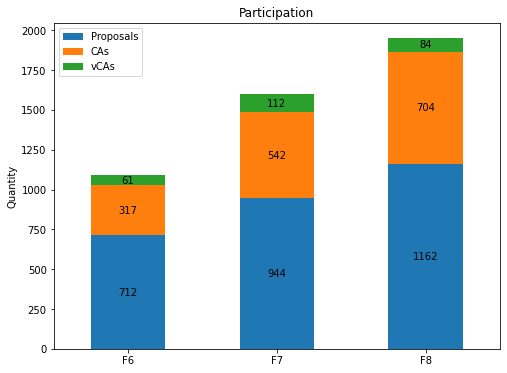
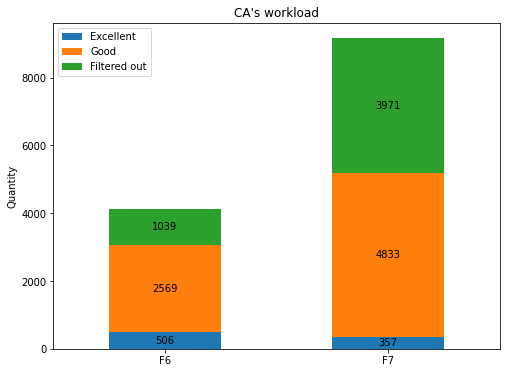
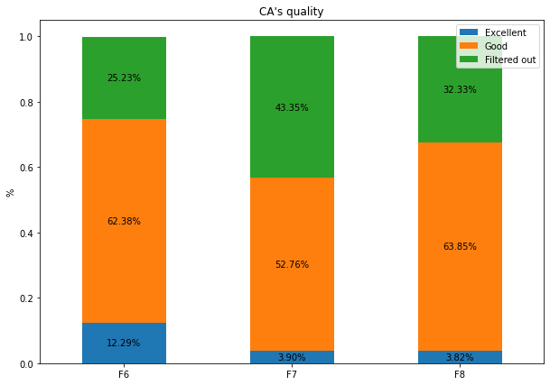
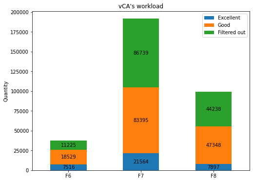
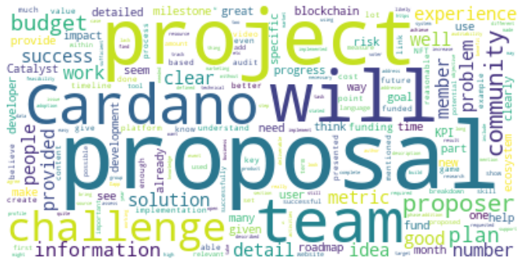
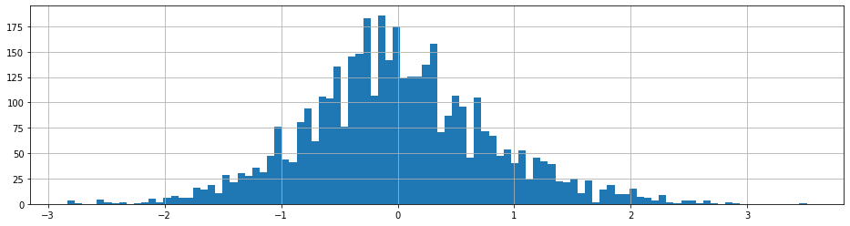
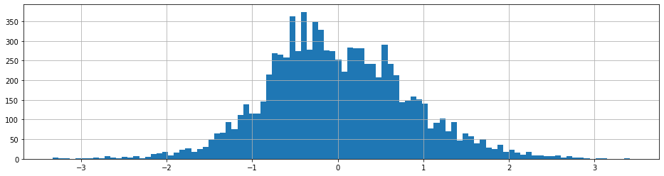
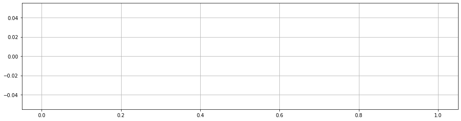

# CA - vCA statistics
## Data source
- [vCA Aggregated - Fund 6](https://docs.google.com/spreadsheets/d/1hEUq2mCEYUk-oWaU-dFESu0lyo5zRR2HL7M7O8aURes/edit#gid=0)
- [vCA Aggregated - Fund 7](https://docs.google.com/spreadsheets/d/1ZM3ytXkMB34iSo2LamNxpver-rs9fShnpeNEia-VdBo/edit#gid=1623244429)
- [vCA Aggregated - Fund 8](https://docs.google.com/spreadsheets/d/1EFnMK1A4Umu_a6U-bYY7XHpf27Ojb_ZMzxOPngJ3wnE/edit#gid=1324970937)  
- [vCA Aggregated - Fund 8 (top vCA removed)](https://docs.google.com/spreadsheets/d/1hHp4YTEvEuOtXHZzlGESBx-UtOtd9pxjbXWXzDpyY6I/edit#gid=1439112888)  
## Engagement

## Proposal's quality

## CA's workload

## CA's quality

## vCA's workload

## Additional stats

<table border="1" class="dataframe">
  <thead>
    <tr style="text-align: right;">
      <th></th>
      <th>F6</th>
      <th>F7</th>
      <th>F8</th>
    </tr>
  </thead>
  <tbody>
    <tr>
      <th>Proposals</th>
      <td>712.00</td>
      <td>944.00</td>
      <td>1,162.00</td>
    </tr>
    <tr>
      <th>CAs</th>
      <td>317.00</td>
      <td>542.00</td>
      <td>704.00</td>
    </tr>
    <tr>
      <th>vCAs</th>
      <td>61.00</td>
      <td>112.00</td>
      <td>84.00</td>
    </tr>
    <tr>
      <th>proposals/CAs</th>
      <td>2.25</td>
      <td>1.74</td>
      <td>1.65</td>
    </tr>
    <tr>
      <th>CAs/vCAs</th>
      <td>5.20</td>
      <td>4.84</td>
      <td>8.38</td>
    </tr>
    <tr>
      <th>Assesments/vCA</th>
      <td>67.51</td>
      <td>81.79</td>
      <td>131.15</td>
    </tr>
    <tr>
      <th>CA's assessments [mean]</th>
      <td>12.99</td>
      <td>16.90</td>
      <td>15.65</td>
    </tr>
    <tr>
      <th>CA's assessments [median]</th>
      <td>5.00</td>
      <td>4.00</td>
      <td>6.50</td>
    </tr>
    <tr>
      <th>vCA's reviews [mean]</th>
      <td>621.16</td>
      <td>1,711.58</td>
      <td>1,067.23</td>
    </tr>
    <tr>
      <th>vCA's reviews [median]</th>
      <td>306.00</td>
      <td>711.00</td>
      <td>488.50</td>
    </tr>
  </tbody>
</table>

## Final scores
### Fund 6

  
Click to show

    ****** F6: DApps & Integrations ******
    Win-Win Dispute Resolution                        5.00
    P2P IoT Marketplaces - Adosia IoT                 4.89
    Dapp to control/monetize your data                4.80
    Cardax - DEX on Cardano phase 2,3,4               4.67
    SuBChain: Subsea Data Ledger                      4.67
    ADAPlus.io - Mass payments system                 4.62
    AdaQuest(aka The Quest for Ada)                   4.57
    Liquifi V2 - efficient DEX protocol               4.50
    Zero-interest-penalty CD Token                    4.50
    Tales In The Blocks|Collab-writing                4.50
    Private Transactions on Cardano                   4.47
    Mirqur DEX - Improved LP Interface                4.44
    Connect discord with cardano                      4.44
    Estati - Real Estate Investments                  4.42
    Arbitration for Smart Contracts                   4.40
    Cardano features for everyone                     4.33
    ALLIN Betting Ecosystem                           4.33
    Blockademia Verification System                   4.33
    Upper/Cut! Unity Card Game dApp                   4.33
    Cornucopias Smart Contracts                       4.33
    API for Multi-Delegation Portfolios               4.22
    BingoToken - Play-To-Earn                         4.22
    Connecting delegators to SPOs.                    4.20
    Fanance Club - Sports Player's DEX                4.13
    Decentralized tutoring marketplace                4.11
    IGIVIT Phase2: Beyond the Prototype               4.08
    Meditation empowered by blockchain                4.08
    Nami Wallet                                       4.06
    NOETH: Cardano for Science                        4.06
    ADA Payments for eCom and Store                   4.00
    Cardano Blue NFT Marketplace                      3.94
    Cardano Healthcare Infrastructure                 3.90
    Cardol.io: Portfolio Tracker                      3.90
    M2 Realfi openhardware                            3.83
    de-way: empowering ideas                          3.78
    Decentralized Content Network                     3.78
    Automated Tax Collection                          3.67
    Staking Pool as a Service                         3.67
    Cardano Music Streaming Dapp                      3.61
    Nature Coin: Climate Change DAO                   3.60
    NFTree: regenerating the planet                   3.60
    Cardano Credit Card                               3.60
    NFT Business lessons                              3.60
    Youbiquitor - Task Marketplace                    3.58
    Telegram Bot Wallet                               3.58
    NFT-Craze Android iOS Light Wallet                3.56
    Trust Funds by Ada                                3.44
    Vanity Address Generator                          3.33
    ccwallet.io - light web wallet                    3.33
    Token Allies: Business Tokenization               3.29
    Fight scammers & protect Cardano                  3.28
    B2B Ecosystem                                     3.22
    DOOH media meets decentralized tech               3.17
    Unique Digital Identity for KYC                   3.11
    Divine Blockchain                                 3.00
    Ledger Live Support                               3.00
    Patient Data Marketplace DApp                     2.92
    Efficient Markets for Public Goods                2.92
    Dapp market for tickets and events                2.92
    Project Rockstar - the MAIN hustle                2.83
    Dolos: dVPN                                       2.83
    projectNEWM: Fair music ecosystem                 2.83
    Payments for High Risk Businesses                 2.78
    IG-inspired DApp for Pet lover                    2.75
    Liquidity for cross-border payments               2.75
    School of Life                                    2.75
    Bring traffic to brick&mortar biz                 2.71
    Data Marketplace with AI powered                  2.67
    Project Babbage: Ada Makes Movies                 2.67
    Gas Pipeline Security upgrade.                    2.67
    CcNFTs: Empowering Musicians                      2.57
    Multisig For Building EVM Bridges                 2.56
    Pilot traceability of vegetables                  2.54
    Collude: Empowering Artists In Film               2.50
    Gamify Your Life using Cardano                    2.48
    Planet Cardano - Gamification                     2.42
    GIST - Cardano / Polkadot Bridge                  2.38
    Financial Literacy For All                        2.33
    Shark Tank 2.0 - Reality Show                     2.33
    Hard money on Cardano                             2.27
    API powering ticket distribution                  2.27
    Point-of-Sale & Website Checkout                  2.13
    Shared Reality - incentive token                  2.11
    M2-mini-atm                                       2.00
    Shared Reality - immutable database               2.00
    Decentralised Advertising Platform.               2.00
    OctoWars                                          1.93
    Aregato - ADA ebook marketplace                   1.92
    Car service history                               1.90
    Decentralized Music Streaming                     1.81
    NAGchi                                            1.40
    Donors choose - like' application                 1.40
    Ecommerce and lending platform                    1.33
    Help Renters Access Homeownership                 1.33
    M2-World-ERP                                      1.33
    Cardano based trading card game TCG               1.29
    Individuals Security Tracking                     1.28
    communitybond.io Integrate                        1.22
    Sweaty                                            1.17
    Develop to Earn                                   1.08
    Online Shopping                                   1.05
    Marketplace                                       1.00
    DAOs to Fund Projects                             1.00
     
    ****** F6: Developer ecosystem ******
    Plutus PAB Typescript SDK                         5.00
    Gravatar for ADA Wallets                          5.00
    Software as a Service for Cardano                 5.00
    gimbalabs-building network capacity               4.94
    Cardano Wallet lib in pure JS(TS)                 4.92
    Orcfax: trustworthy Cardano oracles               4.92
    Koios - Elastic Cardano Query Layer               4.92
    Cardanoscan API Service                           4.87
    gimbalabs - Plutus PBL program                    4.83
    Dart SDK for Blockfrost API                       4.83
    Retroactive Project Funding SDK                   4.80
    GMBL-turn devs into blockchain devs               4.80
    Bip32Ed25519 pure JS implementation               4.78
    Transaction editor to replace cli                 4.75
    Logosphere - dApp Hackathons                      4.73
    Ikigai - UE4/Unity Plugins & Tools                4.67
    gimbalabs - Dandelion Daemon(s)                   4.67
    Blace.io: Marketplace Creator                     4.67
    Cardano Wallet JS Multisig                        4.67
    Visual Blockchain Designer/Explorer               4.67
    Open-source ISO Toolkit                           4.58
    Blockfrost PAB                                    4.56
    Heidrun Expansion Upgrades - Part 2               4.56
    Dataset - On-Chain Analytics                      4.53
    Continuous Finance Building Blocks                4.50
    Heidrun Expansion Upgrades - Part 3               4.50
    Legacy Databases to Blockchain                    4.42
    Zimbabwe Developers for Cardano                   4.40
    African Blockchain Centre for Devs                4.40
    Dataset - Token / CNFT Analytics                  4.33
    Cardano Analytics Data Hub                        4.33
    Cardano Wallet Flutter SDK - Fund6                4.33
    CardanoSharp - Minting                            4.33
    ADA MakerSpace Bounty Hunters DEVX                4.33
    Elm Integration with Plutus                       4.33
    Reach POC on Cardano                              4.33
    Rust Cardano Networking Crate                     4.33
    Localize Yoroi for Vietnam market                 4.28
    Heidrun Expansion Upgrades - Part 1               4.28
    Legal resources for developers                    4.27
    GameChanger: The onboarding wallet                4.25
    Dataset - Stake Pool Analytics                    4.25
    Localize Yoroi for Bulgaria                       4.25
    Crowdfunding Website for Start-Ups                4.24
    Blockfrost Unity games assets                     4.24
    C64 Modular Wallet                                4.22
    Heidrun Core Management Upgrades                  4.22
    3D-Level editor for game-devs                     4.17
    True limitations of the Marlowe                   4.08
    CardanoSharp - Unity SDK                          4.08
    Contract Labeling & Transparency                  4.07
    Minswap TypeScript SDK                            4.06
    CardanoSharp - UnrealEngine SDK                   4.00
    Treasury for Mini-Proposals                       4.00
    StorJ for NFT storage [NFT-MAKER]                 3.93
    Arweave as NFT storage [NFT-MAKER]                3.92
    Visual DAO Framework                              3.92
    NEO-Cardano NFT Bridge [NFT-MAKER]                3.92
    Multiverse - dApp Rollback Handler                3.89
    CardanoSharp - Interactive Learning               3.80
    CardanoSharp Smart Contract Support               3.80
    Testnet support for API [NFT-MAKER]               3.78
    No-Code Smart Contracts                           3.78
    Africa/Diaspora Dev Tools & Events                3.67
    AI App Builder                                    3.67
    CardanoSharp - Multisig                           3.67
    Cardano Developer Academy                         3.56
    SOLID Software Development Projects               3.56
    Plutus Integration with Pony Lang                 3.53
    BEN Learn Cardano Developer Course                3.52
    Localize Yoroi for Ukraine                        3.47
    Marketing for Ada Integration Tools               3.43
    Localize in Ukrainian and Russian                 3.33
    Cardano meditation network                        3.33
    Bridge between Catalyst and Kaggle                3.33
    ETH-Cardano NFT Bridge [NFT-MAKER|                3.22
    KNuggies Education Platform                       3.20
    IOTA-Cardano NFT Bridge [NFT-MAKER]               3.13
    CCC: Reset Ready?|Value-Flow Wealth               3.11
    Mobile App Template For Blockchain                3.07
    CPU/IOT development for fact data                 3.00
    Tutorchain.io - Cardano use case                  2.93
    Prediction Outcome Verification                   2.92
    CCC: Cardano Multiversity MVP                     2.92
    Delegator Dividend Reward System                  2.89
    Fair Stake Pool Selection                         2.78
    Incentivized Developer Training                   2.67
    NFT API window                                    2.33
    Cryptocurrency Exchange                           2.29
    dApp Templates & GUI dApp Modules                 2.19
    Layer 2 Advanced Architecture                     1.92
    People Centred Design = less risk                 1.73
    Ranking projects built on cardano                 1.67
    Blockchain-Powered forex Market                   1.58
    CCC: Work|Live|Play@MOA                           1.50
    Cardano Data Indexing                             1.50
    Cross-border payment processing                   1.42
    Gaming in Cardano For Mass Adoption               1.33
    Holistic Development Case Studies                 1.17
    NFT Payment Option                                1.11
    A viral onboarding experience                     1.11
    dRISK                                             1.00
     
    ****** F6: NFT Business models ******
    PlayerMint: Community Access NFTs                 4.60
    Phygital Hub for Local NFTs & DAOOH               4.50
    NFT for customer feedback/content                 4.22
    Filamint - 3D Printable NFTs                      4.21
    osNFTs for science popularization                 4.20
    Cardano Preserving Culture                        4.08
    SoHo Ex - Physically backed NFTs                  4.08
    WottleNFT: SDGs Driven NFT Auction                4.00
    Dionysus - For Theatre: Phase 1                   4.00
    Collaborative painting using NFTs                 4.00
    Cornucopias The Island NFT Game                   3.94
    Digital Asset Management Tool                     3.83
    Solar Energy Expansion Via NFTs                   3.73
    WILD NFT                                          3.73
    Mission Driven NFTs                               3.67
    Loyalty and outreach campaigns                    3.67
    Cinefund - Residual backed NFTs                   3.61
    Mushroom Breeding Program                         3.60
    Solletia - Indie music NFT website                3.56
    Ikigai - Disrupting Games via NFTs                3.56
    Intellectual Property Transactions                3.50
    Decentralized Content Distribution                3.50
    Verifiable Game Achievement NFT                   3.44
    Artifact- NFT for Real Property                   3.44
    Multi Owner NFT's                                 3.39
    NFT Gaming Model + Token economics                3.33
    CONTENT MARKETPLACE SUPPORTED BY AI               3.33
    CARDANO IPR                                       3.33
    Anime NFT game - gap in the market                3.33
    Cardano Onboarding Funnel via NFTs                3.25
    Asset Management on the Ledger                    3.25
    NFT's as Proof of Donations (PoD)                 3.22
    NFT for the masses                                3.22
    NFT for Real estate and Land                      3.17
    NFTs for Architecture & STEM                      3.17
    Skill Certification for Mediators                 3.17
    NFTs as event-and transport tickets               3.13
    Bets as NFTs.                                     3.13
    NFT bridge and mega-gallery                       3.10
    African Cultural NFT Treasury Model               3.08
    ForestConservation + CarbonCredits                3.07
    Conservation of Life on Earth                     3.06
    Digital Twin NFT for Farm products                3.00
    Explorie the next NFT platform                    3.00
    Get points for sharing knowledge                  2.89
    Certified Qualifications via NFTs                 2.89
    Sustainable Footwear & Prosumers                  2.89
    Cardano Affordable Housing - 日本                   2.83
    Marketplace for tokenized property                2.83
    Tech Town Cardano                                 2.78
    Real NFT-Gallery & voting tool                    2.67
    Fast Fetching Collectible Cache                   2.67
    NFTs for BETTER HEALTHCARE                        2.58
    OmiMimo: The 1st e-NFT on Cardano                 2.50
    Cardano NFT Idea Patenting                        2.44
    Mimic Nature with Living NFT                      2.44
    Engaging eco-NFTs for the Planet                  2.33
    nftAno - Bring your CNFT !                        2.33
    CyphrLive Ticketing                               2.33
    Mortgage Equity Realisation                       2.22
    Commodity Exchange Market                         2.22
    Global Network of Crypto Lawyers                  2.10
    Onadracs Video Game                               2.08
    NFT Education & Test Token                        2.00
    Defi Loans, NFTs and On-Network ID                1.92
    Building Affordable Houses Quickly                1.89
    Fractionalized Investing                          1.89
    A Simple Cardano NFT Mobile Wallet                1.76
    NFT for Authenticating Luxury Goods               1.67
    Exchange NFT for physical product.                1.61
    NFT for translation rights                        1.60
    Souvenir                                          1.59
    ADA trading metaverse                             1.53
    NFT Real Estate                                   1.47
    Hup | hearth up                                   1.47
    Toddler HODLer Generative NFTs                    1.44
    NITTYGRITTY (NEW MEDIA)                           1.42
    Bidpool.xyz - NFT Governance Tokens               1.40
    Community Bond -Loyalty Rewards                   1.29
    NTF Gaming                                        1.28
    WITHDRAW                                          1.17
     
    ****** F6: Multilingual resources ******
    Educational Content in a Single Web               5.00
    On-boarding East Asia Today!                      4.87
    Bring Smart Contracts to Vietnam                  4.83
    CatalystSchool - Eastern Hemisphere               4.81
    Cardano Center Poland - web and SM                4.73
    Spanish News, Insights, Onboarding                4.71
    ALDEA Wiki - Phase 2 - Portuguese                 4.67
    Japanese SPO community management                 4.56
    The Catalyst School - Multilanguage               4.47
    French & Arabic resources &trainers               4.40
    Voter tool translations - AIM                     4.40
    Translating ProjectCatalyst                       4.25
    Indonesian Community Web-Portal                   4.22
    SPOCRA: Expand Geographic Reach                   4.17
    Catalyst Course in Vietnamese                     4.14
    Cardano Project in Spanish                        4.04
    Multilingual Cardano Chatbot & KB                 4.00
    100 Cardano animations non English                4.00
    French Intro to Cardano in Burkina                3.87
    Lovelace translation Portuguese                   3.67
    Content translation for Chinese                   3.67
    Cardano news in Chinese                           3.52
    Translation into Amharic                          3.50
    Babelada - Translation Community                  3.40
    French website to learn cardano                   3.33
    A Graphic Cardano Knowledge Corpus                3.33
    SEMANA CARDANO                                    3.33
    Translate NFT-MAKER to German                     3.29
    Educational materials about Cardano               3.00
    Cardano BI - Native languages                     2.94
    Short videos in (african) french                  2.75
    [Romania] Cardano Business Club                   2.60
    Translation - Ukrainian - Russian                 2.58
    Localize Yoroi in French                          2.47
    Cardano Romania Community Knowledge               2.13
    GameChanger: IPS Program                          2.00
    Multilingual NFT artist Giveaway                  1.89
    Multi-Source Translation Pipeline                 1.67
    Pull strategy for Spain                           1.53
    Encourage Adoption in Universities                1.43
    Coding Pods                                       1.00
     
    ****** F6: Atala PRISM DID Mass-Scale Adoption ******
    Interoperability as growth driver                 4.78
    Proof of identity for mediators                   4.50
    DID Solutions for Local Governments               4.50
    A Passive Interface Pair (DID)                    4.50
    Universal Skills Authentication                   4.50
    DID in Congo Universities                         4.42
    PACE: Community credentials                       4.33
    Control your data (vault) via PRISM               4.28
    ⭐Self-Sovereign DID Badge Passports               4.27
    ACADEMY Lifelong Learning Suite                   4.25
    Decentralized Certificates                        4.25
    MySmartWill: evolution for tomorrow               4.22
    Decentralized eLearning & DIDs                    4.20
    DARP: Cardano Address Name Service                4.07
    African Housing Payments App                      4.00
    Generic certification solution                    3.93
    Your DID for climate impact                       3.87
    DID for verified Career Audit Trail               3.78
    Import passport data to AtalaPrism                3.67
    Paths to adopt DID in small cities                3.58
    DIDs for Animal Records                           3.50
    Biometric<->DID Binding Credential                3.50
    Education verification with DID                   3.44
    Cardano Interop NOW                               3.44
    Biometric Smart Card Integration                  3.33
    BIT - Basic Income Token                          3.22
    Play-to-learn-and-earn DID-Platform               3.22
    Optimizing student agency with DIDs               3.08
    Verify NFT authenticity [NFT-MAKER]               3.00
    Tutorchain.io - Expert identity                   2.92
    Cardano Grants Management Systems                 2.78
    Distributed Health Records                        2.75
    Welcome to the Oasis, Please Login                2.75
    Dyana holistic health DID                         2.67
    BingoChain - User Authentication                  2.58
    DIDs for public services in the US                2.56
    Dvoting System in Brazil                          2.50
    CUBI Cardano Universal Basic Income               2.33
    DID as a bridge to Microsoft                      2.33
    Aegis Esports DID Platform                        2.00
    Cardano Sign-In                                   1.33
    Maternity Medical data in Ethiopia                1.33
    gigDID                                            1.27
    CCC: PRISM RIDE @MOA; 40M Visits/yr               1.25
     
    ****** F6: Grow Africa, Grow Cardano ******
    TheCatalystSchool - Focusing Africa               5.00
    Elevating Manufacturing in Africa                 4.83
    MCA: A Model School in South Africa               4.78
    Wutano Token - Africa Health System               4.67
    Global Sustainable Stories/Usecases               4.50
    Swahili News, Insight, Onboarding                 4.47
    Planting Roots in Africa                          4.40
    P2P:Trade Cardano tokens with Cash                4.33
    African Learning Institutions SPOs                4.33
    Cardano Health Infrastructure                     4.29
    Cardano Africa Starter Kit (CASK)                 4.17
    iFoncier Land Registry Burkina Faso               4.07
    ADA News in African languages                     4.00
    Supply-Chain for Agriculture                      3.93
    Black Rhino                                       3.83
    Smart Thrift Savings Wallet                       3.83
    Plutus Lottery ADA Game                           3.67
    Sudan ARABIC Cardano Community                    3.67
    Cardano Fellows Uganda (CFU)                      3.56
    Transform Africa through Technology               3.33
    Africa Opensource Pharma & Medicine               3.29
    Payment with ADA in Ethiopia                      3.27
    Fair Pricing for Ethiopian Coffee                 3.17
    Employment Contract Dapp                          3.00
    LINX: Chat | Connect | Trade                      3.00
    Enable Digital Governance                         2.83
    DApp Binding Arbitration Africa                   2.83
    Blockchain powered banking                        2.73
    Auto-onboard smallholder farmers                  2.39
    Location, Location, Integration                   2.33
    JUNGLE                                            2.33
    WiFi Hotspots & Internet Cafes                    2.27
    Connect, Trust, Invest : Africa                   2.07
    Digitised Certificate of Origin                   2.00
    Locating Culture                                  1.76
    Farm Management Software in Africa                1.75
    Incorporating Non Profits                         1.67
    Cardano and Christianity for Africa               1.56
    SHiELD Africa, grow Cardano                       1.50
    Identify access to technology                     1.17
    Restrictions and barriers                         1.00
     
    ****** F6: Fund7 challenge setting ******
    Community Events                                  5.00
    Disarm cyber disinformation attacks               5.00
    Lobbying for favorable legislation                5.00
    Boosting Cardano's DeFi                           5.00
    Catalyst - Rapid Funding Mechanisms               5.00
    Seeding Cardano's Grassroots DeFi                 4.89
    Gamers On-Chained                                 4.87
    DAOs <3 Cardano                                   4.83
    DApps & Integrations                              4.83
    New SPO Business Opportunities                    4.83
    Scale-UP Cardano's Community Hubs                 4.78
    Global Sustainable Indep. SPO's                   4.73
    Improve and Grow Auditability                     4.67
    Raising small ghosts, SPOs and devs               4.67
    Nation Building Dapps                             4.67
    Multilingual resources                            4.67
    Grow Latin America, Grow Cardano                  4.67
    Increasing Diversity in Catalyst                  4.67
    Miscellaneous Challenge                           4.56
    Governance Parameter Ideation                     4.56
    Grow Cardano Act Sustainably                      4.56
    Open Source Developer Ecosystem                   4.56
    Mini/Low-Budget Dapps &Integrations               4.50
    A.I. & SingularityNet a $5T market                4.50
    Developer ecosystem                               4.44
    Already Approved Project Challenge                4.44
    Realfi                                            4.33
    Metadata challenge                                4.33
    Infrastructure Boost in Africa                    4.33
    Grow Africa, Grow Cardano                         4.17
    Atala PRISM DID Mass-Scale Adoption               4.17
    Distributed decision making                       4.14
    Challenge Governance: The next step               4.11
    Climate Change: THE Challenge                     4.06
    Proposer outreach                                 4.00
    DeFi and Microlending for Africa                  4.00
    Connecting Japan/日本 Community                     4.00
    Prototype Diversified Voting Method               4.00
    Equip the Economically Excluded                   3.83
    A financial OS for the 99% - now!                 3.83
    Grow Global Economic Identities                   3.78
    Overhaul Catalyst                                 3.67
    Research Challenge                                3.67
    Grow Social & Environmental Finance               3.33
    Help Small Countries Adopt Cardano                3.33
    Grow East Asia, Grow Cardano                      3.33
    Making Web3 Visible                               3.11
    Raise Catalyst's reach & awareness                3.00
    Anti-scam & anti-fraud campaign                   3.00
    Community Roadmaps for Cardano 2025               3.00
    DLT Entrepreneurship Toolbox                      3.00
    Cardano Ecosystem Gender Equality                 2.83
    Tackle & solve impossible problems                2.67
    Funding for Traditional Businesses                2.58
    Mission Driven Challenge                          2.56
    Local Agriculture Market                          2.33
    Remittances                                       2.11
    Grow with Catalyst                                2.00
    DeFi/CeFi Cardano&...TBC in Fund 7                1.67
     
    ****** F6: Scale-UP Cardano's Community Hubs ******
    Homeless Hub                                      5.00
    Cardano Canvas, Cards & Calculator                4.83
    BR/US University Hubs!                            4.67
    SalmonNation Decentralized Alliance               4.67
    DisCO of Urgency                                  4.58
    BLOCKCHAINTRANSLATION.IO                          4.53
    Cardano in South L.A.                             4.50
    Cardano Hub Buenos Aires                          4.50
    Cardano Vietnam Information Centre                4.44
    Translator Collaboration Platform                 4.42
    Add multilanguage to CNFTHub.io                   4.33
    Exhibit Largest BlockChainEXPO(JP)                4.22
    Interactive Cardano Ecosystem Map                 4.00
    Cardano Innovation Hub                            3.95
    Influencing Policy for Adoption                   3.67
    Cardano Hub Venezuela                             3.56
    Regional Revitalization JP-Meetup                 3.33
    Engage African students on campus                 3.17
    Cardano Hub - Eastern Europe                      3.11
    No-Code Hackathons                                2.83
    Alexa Skill for Cardano news feeds                2.44
    Scale up Cardano by JPN Publication               2.33
    1 Cafe to the World                               2.15
    Cardano Care - Charity Across Conti               2.11
    Community Bond - CRM for SME's                    2.07
    Cardano Learning Centers                          2.00
    Stop giveaway scammers                            1.78
    ADA giveaway or lottery                           1.67
    YouTube Giveaway Scammers                         1.60
    Coding Challenges                                 1.44
    AtalaGotchi's Community                           1.44
    [Moved] Payment in ADA                            1.44
     
    ****** F6: Proposer outreach ******
    Fund 7+8 Campaign                                 4.92
    Connect East Asian Entrepreneurs                  4.89
    WADA Proposer Workshops                           4.61
    After Town Hall by Swarm                          4.61
    Proposals Mentors Marketplace                     4.50
    Cardano Community Campus                          4.25
    CARDONEX ⚡                                        4.17
    Fostering Japanese young proposers                4.17
    Taiwan Outreach                                   4.00
    Entrepreneurs/Developers Community                4.00
    Video content about Mini-Proposals                3.92
    University/College Outreach                       3.89
    No-Code for Citizen Developers                    3.87
    Hackathons for Startups in Ethiopia               3.73
    Cardano exposure on Times Square                  2.67
    Catalyst Infosession at Tech Events               2.67
    Cardano & Enterprise Dev Agencies                 2.53
    Develop Cardano visuals                           2.44
    Vietnam Tech StartupClub on Cardano               2.42
    🎬 "Working Title" Film Project 🎬                  2.40
    A YT Channel On Decentralization                  2.33
    SOIL - Scalable Open Innovation                   2.25
    SMALL GROUPS BETTER UNDERSTAND                    2.00
    Small Business Case Study                         1.92
    Catalyst Crypto Venture Capital                   1.79
    GovWorkCenter Platform                            1.75
    Competition (Top 40 under 40)                     1.39
    Community Bond - CRM tool for SME                 1.19
    ADA buyers collection                             1.00
     
    ****** F6: Metadata challenge ******
    CardanoWall, new levels of PoE                    4.91
    Applying Oracle Performance Metrics               4.89
    Logosphere - Cell Level Security                  4.83
    How often can a brand contact you?                4.67
    Give Users security and confidence                4.58
    Frictionless document verification                4.58
    Data traceability and verification                4.50
    Books: Legacy Discovery                           4.40
    Metadata search engine enhancements               4.17
    Tutorchain.io - On chain reviews                  4.08
    Cross-chain Asset Transfer Standard               4.00
    Open health metrics in Colombia                   3.89
    Meta-data financial real use case🔥                3.67
    IoT powered Blockchain Metadata                   3.67
    Deqree: Certificate Validation 🎓                  3.67
    Donation & Reward Tracking                        3.22
    Smart Authentic Tokenized Assets                  3.20
    Foorigin: The Future of Food Chain                3.00
    Food Provenance Data Standard                     3.00
    Stable-token Registry                             2.67
    AtalaGOTCHI                                       2.56
    Metadata in Production                            2.56
    Immutable record of Random Numbers                2.17
    Decentralized World Data Bank                     1.89
    Generative & Evolving NPC Traits                  1.38
    Proof of Insurance                                1.29
    ADA Holders Functioning as Banks                  1.20
    Sea Safe platform                                 1.14
    Knowledge Graph platform                          1.14
    Community Bond - Metadata                         1.00
     
    ****** F6: Scale-UP Cardano's DeFi Ecosystem ******
    Maladex: Algorithmic Swaps Protocol               4.72
    Maladex: Cardano Index Funds                      4.48
    DeFi for Cardano - Learning Portal                4.22
    Indigo: Synthetic Assets on Cardano               4.19
    Ensuro: A Decentralized Insurance                 4.07
    Minswap DEX Security Audit                        3.89
    Cardano Offline Developer's Kit                   3.78
    Tools for auto and home loans                     3.75
    Community Oracle (free) Price Feeds               3.71
    Fund unlimited social microlending                3.58
    Wise Rabbit- Livestock Investment                 3.40
    Milkomeda Oracle                                  2.83
    Algorand - Cardano DeFi bridge                    2.52
    Panther - Private Layer 2 Protocol                2.25
    AdaSwap - The next-gen DEX!                       2.08
    Liquid Labor - Freelancer Contracts               1.76
    Decentralized Sous Sous Savings                   1.72
    Oracle for CPI data                               1.67
    Fantasy Bidding with Staked Funds                 1.58
    DeFi Bounty System                                1.56
    Mosaic: DeFi Functionality for NFTs               1.27
    Pharo ACM                                         1.11
    Influence Quality Price & Image                   1.00
     
    ****** F6: Catalyst value onboarding ******
    In-Wallet Onboarding for ADAholders               5.00
    The Catalyst School                               4.90
    Match members profiles with tasks                 4.78
    Incentivized Voter Survey - AIM                   4.75
    The Catalyst School - Website                     4.67
    Community Site: Development - AIM                 4.67
    WADA Uni Students Catalyst Registry               4.58
    Community Subscription Fees Recoup                4.56
    Catalyst-Swarm-Genesis GitBook                    4.53
    Weekly Swarm Sessions                             4.50
    Eastern TownHall Team Operation                   4.48
    80 Multi Language How to ?-podcasts               4.33
    Catalyst Video Series w/Kaizen                    4.22
    Off to On-Chain Self Governance                   4.17
    The Catalyst School - NFT Rewards                 4.11
    Animated Explainer Videos-AIM                     3.93
    Let's make Live-NFT's with 2500 Art               3.89
    Micropayments for Catalyst                        3.83
    Global Mission Driven News Room                   3.67
    Decentralized Catalyst Incubator                  2.92
    The Blockchain Class by Adatruth                  2.78
    Tutorchain.io - Catalyst use case                 2.78
    Catalyst Buddies System                           1.83
    Marketing, Marketing, Marketing!                  1.50
    Catalyst 24h Streaming TV Programs                1.40
    NAGchi Cares                                      1.28
     
    ****** F6: Distributed decision making ******
    Community Tools Maintenance/Updates               4.94
    Catalyst QA Automation scripts                    4.92
    Catalyst: Exploratory Data Analysis               4.88
    Connecting Asian Voters & Proposers               4.78
    Voter Tool - AIM                                  4.70
    Power Up The Catalyst Circle                      4.67
    Oversight of Catalyst Circle                      4.64
    Catalyst Interactive News Journal                 4.57
    Distributed Work-Reward Mechanism                 4.33
    Consenz: A Virtual Parliament App                 4.27
    Cardano Smart Voting                              4.25
    Design & Sim of Voting Influence                  4.22
    Cardano Catalyst TV                               3.96
    Catalyst Proposals Assessment Guide               3.92
    2Min Review                                       3.83
    Stake Pool Operators Video Series                 3.50
    Catalyst Compass                                  3.42
    Distributed Collaboration Protocol                3.25
    Improve the Quality of CA Reviews                 2.33
    Testing MyVoice MVP in Catalyst                   1.44
     
    ****** F6: DLT Entrepreneurship Toolbox ******
    IDEA FEST for Fund 6 + 7                          5.00
    Entrepreneur Community Mentoring                  5.00
    Catalyst Virtual Start-up Bootcamp                4.73
    Community-Made Interactive Guides                 4.58
    Scale up WADA's Outreach Program                  4.47
    Mini Proposals as a Service                       4.42
    Open Source Training                              4.33
    Proposal Framework Tool - AIM                     4.33
    Proposal Templates + Guidelines                   4.25
    Catalyst Entrepreneur's Book Club                 4.17
    PACE: Idea collaboration tool                     4.17
    Library of Proposer Case Studies                  4.13
    Helix Hub Impact Accelerator                      4.00
    AntFarm                                           3.20
    Submission templates and examples                 3.08
    Tutorchain.io - for Entrepreneurs                 2.93
    Growthwheel Business Planning Tool                2.87
    Intellectual Property Training                    2.75
    Copy writing for DLT Entrepreneurs                1.56
    Cardano roadmap to adoption                       1.47
    Bond - Connecting entrepreneurs                   1.44
    TrillionCoin Global Charity Token                 1.00
    CARDANO Branding In Indonesia                     1.00
     
    ****** F6: DeFi and Microlending for Africa ******
    Direct Donation for Education                     4.96
    CheCha - With ADA Wallets                         4.67
    Defi Credit Union Via Crowd-staking               3.71
    Microlending Partnership Models                   3.67
    Green Lion (GL) lending in Ghana                  3.44
    Distributed Income Share Agreements               3.08
    StableCoin Wallet without Internet                2.89
    Lending platform for africans                     2.29
    Scaling up Tontine                                1.78
    Oracle CPI data 47 African counties               1.60
    Helping African Social Savers                     1.54
    Trade Finance and Credit Insurance                1.27
     
    ****** F6: Improve and Grow Auditability ******
    Distributed Auditability                          4.64
    Treasury & Catalyst Proposal API                  4.38
    Smart Contract Audit Token SCAT DAO               4.33
    PACE: Proposal progress updates                   4.25
    PACE: Proposal media content                      3.94
    Auditing African Proposals, by WADA               3.67
    PACE: Proposal completion reports                 3.50
    Financial Audit Taskforce                         3.27
    FundTrack - Approve Before Spend                  2.47
    The Catalyst Story by Adatruth                    2.42
    Audit via DAO                                     1.86
     
    ****** F6: Partnerships for Global Adoption ******
    Research in Applying Frameworks-AIM               4.78
    Almagua DAO                                       4.00
    WottleNFT: SDGs Driven NFT Auction                3.75
    Add SDG ratings to proposals - AIM                3.73
    Partnership for De-Fi Adoption                    2.67
    Tokenised crypto events (ICWT)                    2.67
    Research dApp                                     2.50
    Cardano Powering Planet Improvement               2.05
    Involve more gov. & UN officials                  1.83
    The Roadmap Revisited                             1.58
    Rapid prototyping ...made easy                    1.50
    Endangered Language Preservation                  1.33
    Books for Blocks                                  1.17
     
    ****** F6: Cardano Emerging Threat Alarm ******
    Automated Phishing/Scam Detection                 4.87
    CARDANO DLT-360 RISK RADAR                        4.25
    DragonDefender Spam/Imposter Killer               4.00
    Smart Contract Blacklisting                       3.81
    Cardano Risk Profile Audit                        3.75
    Crypto Regulation Surveillance                    3.25
    Scam Alert                                        2.39
    Automated Cyber Threat Intelligence               1.92
    Cardano Threat Identification                     1.56
     
    ****** F6: Disaster: When all is at stake ******
    Cardano-Heartbeat (CEM) 💞                         4.83
    Strengthening Stake Pools in Africa               4.67
    Stake Pool Reachability Dashboard                 4.33
    SPOCRA: Re-location Fund for SPOs                 3.75
    CardSec 🔒                                         3.67
    Blockfrost prometheus exporter                    3.27
    Cardano Disaster Recovery Education               3.25
    Repository of SPO Testing Resources               2.78
    ADA SPO ITsec Label                               2.67
    A.S.T.O.P. - Stop Scams & Threats                 1.90
     

### Fund 7

  
Click to show

    ****** F7: Community Events ******
    Insight Sharing Workshops - TCS                   4.83
    Idea Fest by Catalyst Swarm                       4.79
    Cardano4Climate Community Events                  4.78
    Catalyst Swarm 2022 GitBook                       4.76
    QA-DAO Transcription Service                      4.71
    Bridge Builders - Governance Events               4.62
    After Town Hall by Catalyst Swarm                 4.59
    Catalyst Events 4 Vietnam Students                4.58
    Mini Proposal Workshops                           4.57
    Dumpling Twitter Space                            4.52
    Challenge Fest by Catalyst Swarm                  4.48
    Co-Creating Events Together                       4.48
    Cardano event in a Parisian Theatre               4.43
    Haskell & Coffee ☕                                4.42
    Clubs+hackathons = Cardano adoption               4.41
    Add a calender for community events               4.39
    Mass Cardano Education for Students               4.38
    Eastern Town Hall                                 4.33
    NFT Guild                                         4.29
    Grow Afriteen, grow Cardano ERGhana               4.17
    Cardano Creatives Swarm community                 4.17
    Collaborat'n for global risk issues               4.13
    DAO-NET: Communication & Outreach                 4.08
    Project Catalyst HeartBeat                        4.03
    College Student Recruitment                       3.97
    Cardano goes to Milan                             3.82
    KONMAHOOD - Defining Communities.                 3.80
    The Cardano Classroom                             3.80
    Cardano local live events - Poland                3.64
    Build Cardano community in Tanzania               3.58
    Local Cardano Meetups                             3.39
    MetaCenter: Cardano + Metaverse                   3.12
    Cardano Events in Ukraine 20 cities               2.96
    #G4L Gaming Expo-Festival 2022 GSA                2.94
    Conference on No-Code & Blockchain                2.79
    Catalyst Infosessions in Ethiopia                 2.54
    Social Media For Blockchains                      2.42
    Catalyst Snippets via Social Media                2.30
    Sustainability & Food Provenance                  2.21
    Educating head porters in vocations               2.05
    Africa's reliance on donations                    1.40
    Conservation factory phase 1                      1.33
    More activities with investors                    1.28
    Redeploy Catalyst                                 1.25
     
    ****** F7: DApps & Integrations ******
    OpenScienceNFT Marketplace                        5.00
    Community Tools On Chain! - AIM                   4.92
    Web based transaction editor                      4.86
    Anonymity & data control online ZKT               4.83
    GameChanger: smart contract support               4.78
    No code, audited Smart Contracts                  4.78
    Liquidity Aggregator for Cardano                  4.75
    i3D Mass Adoption Protocol                        4.75
    NFT Verification Tool (Open-Source)               4.75
    C64 Extension Wallet                              4.73
    ADA Handle Wallet Authentication                  4.72
    DAO-NET: Voting DApp                              4.67
    Rythmeet:a versatile music platform               4.67
    Portal: NFQ's digital asset mgmt.                 4.58
    Events Adoption & Reward                          4.58
    Treedano: NFTs for mature trees                   4.56
    StreamChainQuery                                  4.50
    Project Catapult: None left behind                4.50
    Distributed storage Infrastructure                4.50
    Cardol.io - Portfolio Tracker                     4.46
    Fractionalized NFTs v2                            4.44
    Decentralized Music Platform                      4.42
    Thrift Mobile Wallet                              4.40
    Account authentication                            4.33
    Medusa Wallet                                     4.22
    The Climate Change Lottery                        4.20
    ALLIN Betting DAO                                 4.17
    DeFi tools for Content Creators                   4.13
    Trustless Cardano Ethereum bridge                 4.08
    Dapp for Art & Creator Discovery                  4.08
    Win-Win Platform Auditing                         4.08
    P2P Manufacturing with Adosia IoT                 4.07
    Frictionless document verification                4.00
    Cardahub-Hub of services on Cardano               4.00
    FetaChain: Renovating the Foodchain               4.00
    Verifiable NFT-based resumes/CV                   3.94
    Benefits App                                      3.93
    Integration in Trustee Wallet                     3.93
    Urban Farmer dApp                                 3.89
    NFT-DAO Boxcar Framework Contracts                3.83
    Cardano Smart Students DApp                       3.81
    Estati - Real Estate Investments                  3.78
    open source automation for cardano                3.75
    Bring Ethereum NFT users to Cardano               3.72
    Trustful Global Projects                          3.67
    P2P dApp for sharing tech gadgets.                3.62
    Divine Blockchain - Phase I                       3.61
    Music NFT Launchpad                               3.50
    Cardano features for everyone                     3.40
    Anti-counterfeit B2B ecosyst Africa               3.33
    Wine open market - Stappato                       3.33
    Local Charity Fundraising Platform                3.27
    ADA to Mobile Money App                           3.22
    NFT Trading Platform / DApp                       3.22
    Galaxy Art DeFi Art Gallery                       3.11
    Reverse Bidding Platform                          3.11
    Before Will DApp                                  3.08
    NFTPass - NFT Ticketing Solution                  3.08
    Dollar-Cost Averaging DApp                        3.07
    New wallet for all OST participant                2.78
    Safety & Traceability in Cosmetics                2.78
    Vertra: tokenized properties market               2.58
    Dokurizi - decentralised journalism               2.56
    StoryTime - A Writers Marketplace                 2.47
    PRToken                                           2.44
    Blockchain based insurance pool                   2.40
    Building 'Realverse' Metaverse Dapp               2.39
    chain-lib Token Viewer for everyone               2.20
    Breaking Worthless Traditions                     2.04
    Tokenized Scripting as a Service                  2.00
    NFT market place to metaverse                     2.00
    @chain-lib Token mint/sell any site               1.89
    Jakazi Handyman DApp                              1.83
    @chain-lib WordPress Plugin                       1.83
    Supply chains for industry 5.0                    1.81
    Virtual Billboard                                 1.78
    DLT & AI for Transport & Logistics                1.71
    Decentralized Bees Delivery System                1.67
    Embedded EUTXO Manager                            1.58
    @chain-lib bundle selling component               1.56
    Interaction with blockchain                       1.56
    @chain-lib Bidding Smart Contract                 1.50
    Market-Agnostic Recursive Royalties               1.47
    Content Wallet for Experiences                    1.40
    Smart Contract Video Streaming                    1.22
     
    ****** F7: Grow Latin America, Grow Cardano ******
    Introductory Blockchain MOOC PT-BR                4.90
    GameChanger: Dandelion Deployment                 4.78
    LATAM Industry Presentation Kit                   4.78
    LATAM Town Hall by Catalyst Swarm                 4.77
    ALDEA NFT - Community Marketplace                 4.75
    Spanish/Portuguese Voter Survey-AIM               4.73
    Cardano Totem: Onboarding the World               4.67
    Decentralized Education - dTeach                  4.67
    Win-Win Expansion in Latam                        4.67
    New d-EdTech Platform for LatAm                   4.67
    Cardano Ambassadors & Latin America               4.60
    Newcomer Resources en Español                     4.60
    The Catalyst School | LATAM                       4.59
    CardanoRio 2022: Hybrid event                     4.58
    Platform for Cardano Solar Farms                  4.56
    Token Allies, Latam Businesses                    4.56
    Pathform LATAM: Custom growth paths               4.53
    NOETH: Cardano for science in LATAM               4.53
    Sustainable LatinAmerican Use cases               4.53
    Onboard Latin-American Industry!                  4.53
    Endorsing the marginalized                        4.50
    DALE                                              4.50
    Networking/Education LATAM                        4.50
    Gig Economy Marketplace LatAm                     4.42
    Spanish courses for universities                  4.39
    Support small farmers in LATAM                    4.33
    Cardano Training & Complex Networks               4.33
    Latam Women Cardano Plutus Bootcamp               4.33
    DeFi School - Latin America                       4.33
    Cardano Dev Português Brazil                      4.25
    STEM TERRITORY – Online Courses                   4.22
    Grow ALDEA, Grow Latin America                    4.20
    Cardano for STEM Brazilian students               4.17
    Decentralized Content Distribution                4.17
    Food produced with Agriculture 4.0                4.17
    Latam Community DID Research                      4.11
    Test DAO at Latam Public Spaces                   4.08
    cardway.finance - A payment gateway               4.00
    CardAgro - a Marketplace for Agro                 4.00
    Meetup Northeast Argentina 2022                   3.89
    Documental Vamos a cambiar el Mundo               3.89
    DID market study & deployment                     3.72
    Token issuance, backed by land                    3.71
    ATALA Prism in Chaco                              3.67
    Milkomeda Latam Hackathon                         3.58
    Portuguese onboarding Video Series                3.42
    Technical school for Latin America                3.28
    Peace Blockchain Study, Colombia                  3.28
    🔰 dVote - LATAM 🔰 AtalaPRISM                      3.20
    Blockchain Latam Ecosystem Mapping                3.17
    Lovelace translation Portuguese                   3.08
    Milkomeda documentation (es & pt)                 2.92
    Living Waters Costa Rica                          2.87
    Decentralized Music Platform LatAm                2.67
    Democratising Blockchain in Latam                 2.67
    SOIL: Regional education                          2.33
    LovelaceAcademy translation Spanish               2.33
    Clean water, raise awareness.                     2.22
    NFT MARKETPLACE LATIN AMERICA                     2.20
    Demystify Blockchain in LATAM                     2.19
    Nourish LATAM: Spirulina & Cardano                2.11
    Cardano Community Development                     1.93
    Latin American artists                            1.90
    Real Estate Dao                                   1.61
    Building a relevant community                     1.53
    Translate Charles Hoskinson videos                1.44
    Influencers as Ambassadors Brazil                 1.38
    LovelaceAcademy website Translation               1.38
    Grow the avocado producer                         1.27
    Marketplace P2P                                   1.25
     
    ****** F7: Miscellaneous Challenge ******
    DLT Governance Classification                     5.00
    Carbon Footprint Ledger                           5.00
    GameChanger: Ledger HW support                    5.00
    The Cardano Carbon Footprint                      5.00
    Project Evaluation Website                        4.97
    Ekphrasis Gitbook                                 4.89
    Catalyst Circle Mentorship                        4.83
    Onboard Manufacturing Industry !                  4.78
    Loxe Inc. Plutus Internship Program               4.75
    SustainableADA Goals Token Research               4.67
    Catalyst Swarm Operations                         4.67
    Industry Presentation Kit                         4.67
    Create Teaming Agreement Templates                4.58
    CCv3: Sustaining the Circle                       4.58
    CC Admin Team Scope Expansion                     4.53
    DLT Classification offside the hype               4.44
    Outreach Campaign                                 4.44
    Cardano Ambassadors Catalyst Guild                4.33
    Catalyst Circle Treasury Management               4.27
    Showcase Film Industry Use-Case                   4.20
    ADA Holder Engagement Survey - AIM                4.17
    University/College Outreach                       4.11
    Cardano enabled sustainable food                  4.11
    NANO Frames - Digital CNFT Frames                 4.08
    Win-Win Web Dev Internship Program                4.00
    Researching CNFTs at Uni of Oxford                3.92
    GameChanger: Most required features               3.89
    RAZ Finance: Decentralized Impact                 3.89
    Candy Pop-Up Campaign                             3.83
    Cardano Cube - Ecosystem Overview                 3.83
    ADAGLASS Data Intelligence Platform               3.78
    Research DAO                                      3.78
    SOLID - IDO (Solidarity platform)                 3.78
    Cryptocurrency Exchange for Africa                3.75
    NFTs for a better world                           3.67
    Near Field Query tap authentication               3.67
    Technical Resource Pool                           3.60
    WILD NFT                                          3.58
    Feature Film 👉Onboarding Hollywood                3.56
    ADA Token to Combat Homelessness                  3.47
    Milkomeda ADA Audit                               3.44
    3D printer hardware interface                     3.38
    Cardano Film Studios                              3.33
    blockchain based Dating App                       3.17
    Formulating a Community Defense                   3.08
    Cardano & Mental Health                           3.08
    Cardano Eco-Village of the Future                 3.07
    Staking for Children                              3.00
    Cardano/Lokole Network integration                3.00
    Cardano Caravan for Advisors                      2.97
    Incrypture- Structured-FI Education               2.92
    Art at the Edge of The Universe                   2.83
    Philanthropy & positive change                    2.73
    Cardano NFT Search Engine                         2.50
    SCAMADA SOS                                       2.39
    SAVINGS CULTURE AMONG THE UNBANKED                2.33
    ADA 4 Science                                     2.21
    NFT Floor-Update                                  2.20
    Real world products                               2.14
    Train 100 Math teachers in Africa                 2.10
    Africans acquiring ADA through USSD               1.94
    Ubuntu Contributionism                            1.89
    NFT Vetted Calendar                               1.78
    Science Hyperspace on Cardano                     1.72
    NFTree protocol                                   1.48
    Native Tokenomics Template                        1.33
    Content Synchronization using Audio               1.20
    AI in geological analysis                         1.20
     
    ****** F7: Fund8 challenge setting ******
    Nation Building Dapps                             5.00
    Scale-UP Cardano's Community Hubs                 4.92
    Climate Change: THE Challenge                     4.75
    Developer Ecosystem                               4.75
    Film + Media (FAM) creatives unite!               4.67
    Grow Latin America, Grow Cardano                  4.67
    Open Source Development Ecosystem                 4.67
    Grow East Asia, Grow Cardano                      4.61
    Cross-Chain Collaboration                         4.61
    Funding Community Service Providers               4.58
    Cardano scaling solutions                         4.56
    Improve and Grow Auditability                     4.56
    Catalyst - Rapid Funding Mechanism                4.52
    New Member Onboarding                             4.50
    Grow Africa, Grow Cardano                         4.48
    Gamers On - Chained                               4.47
    Enabling Micro-Summits in 2022                    4.44
    Open Standards & Interoperability                 4.44
    Distributed Decision Making                       4.42
    Community Advisor Improvements                    4.40
    Distributed Governance                            4.33
    DApps and Integrations                            4.33
    Miscellaneous Challenge                           4.29
    Decentralized Reputation                          4.27
    Catalyst Outreach                                 4.25
    Raising small ghosts, SPOs and devs               4.22
    Accelerate Decentralized Identity                 4.22
    Women of Cardano Involvement                      4.20
    Community Events                                  4.17
    Grow India, Grow Cardano                          4.17
    Self-Sovereign Identity                           4.11
    Business Solutions (B2B & B2C)                    4.11
    Global Sustainable Indep. SPO's                   4.08
    Catalyst Accelerator & Mentors                    4.07
    Lobbying for favorable legislation                4.00
    Small businesses                                  4.00
    IO to the World: Cardano Unchained                4.00
    Grow Turkey Grow Cardano                          3.94
    Open-ended Research                               3.94
    Expand Access to Extend Cardano                   3.93
    GameFi/Metaverse Developer Treasury               3.93
    Boosting Diversity in Catalyst                    3.92
    Grow NGOs, Grow Cardano                           3.92
    Cardanomics                                       3.75
    The Great Migration (from Ethereum)               3.75
    Cardano Contributors League                       3.73
    Art Beyond NFTs                                   3.67
    Cardano Creatives                                 3.67
    Empowering Women through Cardano                  3.50
    Special CARDANO and Donations                     3.50
    DeFi and Microlending for Africa                  3.33
    Funding climate opportunities                     3.27
    Climate Change                                    3.25
    Already Approved Project Challenge                3.17
    Cardano Challenges                                3.00
    Cardano & Scientific Research                     3.00
    👑 Alternatives to Plutocracy 💸                    3.00
    Reaching the Business Community                   2.93
    Building a Trust Framework                        2.89
    Banking the "Unbanked"                            2.83
    Cardano Foresight Challenge                       2.80
    Functional cardano hardware                       2.78
    Cardano & Psychotherapy Quality                   2.76
    Unlock Equity in poor communities                 2.67
    Multi-Round Proposals                             2.44
    Encourage DeFi/Dapps/NFT project                  1.92
    CO2 registry for construction                     1.67
     
    ****** F7: Scale-UP Cardano's Community Hubs ******
    Reward for Community Translators                  4.83
    Penny Lane Liverpool Philosophy Hub               4.83
    Cardano Technical hub in Vietnamese               4.83
    Catalyst in Emerging Markets                      4.78
    Catalyst-Coordinator Hub                          4.78
    Cardano Builders' Hub India                       4.78
    Cardano Mobile Hubs                               4.75
    East Africa Cardano Innovation Hub                4.73
    Cardano Blockchain Lab in Kenya                   4.67
    Geneva Business Development Hub                   4.67
    Grow MALTA, Grow Europe !                         4.67
    Blockchain Learning Center                        4.67
    Cardano4Climate Community Hub                     4.67
    Oxford student hub                                4.62
    Spread Plutus through Africa                      4.61
    Vietnamese Cardano Community's Hub                4.50
    Cardano Hub Indonesia - Workshops                 4.44
    Exhibit Largest BlockChainEXPO(JP)                4.44
    Olon CNFT physical gallery London                 4.44
    Konma Xperience Centre                            4.42
    China Info Hub Continued                          4.40
    DAO-NET: Community Growth DAO                     4.40
    Go-Peds Go-Cardano                                4.40
    MODEL ICT HUB FOR DEPRIVED STUDENTS               4.39
    Cardano to the Every Ghanaian                     4.33
    Cardano Worldwide Community Hubs                  4.33
    Catalyst Fund 8 Challenge Team Hub                4.22
    Growing Cardano in Ethiopia                       4.20
    Scale up Chinese community- videos                4.08
    Zimbabwe Developers for Cardano                   4.08
    2MinReview by Voice for Busy Voters               4.00
    Introducing 100 Cardano Defi in JP                4.00
    University courses                                4.00
    Lokole Education Centre in DR Congo               4.00
    Musicmerge - Decentralized ( Song )               4.00
    Catalyst Swarm & City Hub Playbooks               3.87
    Northeast Argentinian Community                   3.87
    ADAcafé - Community Spaces                        3.78
    Aotearoa, New Zealand Hub                         3.75
    CardanoHTX                                        3.67
    JP-Regional Revitalization Project                3.67
    Build out 14 Digital Language Hubs                3.67
    Detroit + Wada Diaspora Hub                       3.56
    Hardware wallet site / 10meetup JP                3.56
    African Blockchain Centre for Devs                3.44
    East African Cardano Community Hubs               3.38
    Cardano Hub Caracas                               3.33
    Cardano ♥ YouTube ♥ Permaculture                  3.20
    Contributionism worldwide                         3.17
    INDIGO, NFT & SUSTAINABLE FASHION                 3.06
    Empower 400 Marginalized Girls                    2.90
    A Second-Chance Cardano Hub                       2.67
    Video content for CNFTHub.io                      2.58
    Start Haskell Community: Beginners                2.42
    Cardano Community Hub Bulgaria                    2.33
    Cardano Hub West Africa                           2.22
    Skill up Vulnerable Youth                         2.20
    Cardano Hub - Eastern Europe                      2.11
    Cardano FIT - Africa                              1.58
    Hive Mind cNFT Policy ID Validation               1.53
    Hackaton for Entrepreneurs                        1.47
    Culture Cubes                                     1.13
     
    ****** F7: Gamers On-Chained ******
    IRONSKY PlaytoEarn Milestone of ADA               4.92
    Social Mobile Game powered by CNFTs               4.92
    Cardano games assets for Unity                    4.89
    Terra Cognita: AI+Blockchain Gaming               4.88
    NFT Game Assets API - [Revelar]                   4.67
    Cardano After Dark - Hold'em poker                4.61
    Game Token Design [Revelar + Duo]                 4.60
    AdaQuest - Concept Phase 2                        4.58
    Game Asset Management - [Revelar]                 4.53
    Flooftopia: An Adorable CNFT Game!                4.52
    Cross-NFT Gaming: NFT Fighters                    4.50
    No-Code NFT Generator [Revelar]                   4.50
    Game Asset Minting Logic [Revelar]                4.50
    Sandbox-MMO for language learning                 4.47
    Game Asset Image Embed [Revelar]                  4.33
    Defiants: Tales of the Ghostchain                 4.22
    Game Asset Analytics [Revelar]                    4.22
    Gamify LacedWhales Twitter bot                    4.22
    A Moon Based Metaverse on Cardano                 4.22
    Trybbles Blockchain-Enabled AR Pets               4.17
    Adalot the MMO/RPG/ECO-Sim                        4.17
    FulBit - NFT Football Game                        4.08
    Gliese 16c - Asian NFT game                       4.00
    World of Pirates                                  3.96
    Connecting Tabletop Games & Cardano               3.93
    NFT pools for game asset swaps                    3.89
    Onboarding Untapped Communities                   3.89
    Mechverse:Origin NFT based Game                   3.78
    Megaclite - Game Dev and Consulting               3.78
    Plug-n-Play NFT/GameFi Toolkit                    3.75
    ReWILD! : Bison Ranching in AR                    3.72
    CrypTrolls: A DAO Gaming Experience               3.67
    Be a Tree! - The Tree Simulator!!                 3.67
    Firestrike Soccer Game Migration                  3.56
    OMIMIMO The Pure Water CNFTGame                   3.50
    Bears Club - Club Simulation Game                 3.47
    Metahagane - NFT Trading card game.               3.33
    Gamifying Littercoin                              3.27
    Building the Realverse                            2.89
    Cross-NFT Gaming: Shared Metaverse                2.87
    market jetchicken NFT card game                   2.67
    Simple Play to Earn Game                          2.47
    OctoWars - a DCCG based world                     2.22
    Clash royale & starcraft mixed game               2.17
    Money Management Game for Minors                  2.08
    Gaming dApp Hackathon                             2.08
    DeFantasy- Daily Fantasy Football g               2.05
    Fractional minting application                    2.00
    Play-to-Earn NFT Football game                    1.75
    Platform for painters                             1.72
    Virtual Portal: Decentralized Place               1.72
    Naisula and Aida                                  1.40
     
    ****** F7: Multilingual resources ******
    Eastern Town Hall Language Support                4.80
    Sustainable Hub for All Backgrounds               4.75
    Onboard German Industry !                         4.75
    Cardano Center Poland web & socials               4.67
    2Min Review by Vietnamese Voices                  4.67
    GameChanger: Spanish and Portuguese               4.61
    Cardano Text Resources in Chinese                 4.60
    Cardano in Spanish                                4.60
    Townhall Channel in Vietnamese                    4.60
    Presenting auf Deutsch !                          4.42
    Scale-UP Wada's Translation FRENCH+               4.38
    Chinese Discord+Telegram groups                   4.33
    DAO-NET: Multilingual Translation                 4.33
    Community Web Portal in Bahasa                    4.31
    Konma Upskill                                     4.30
    Cardano Catalyst TV                               4.22
    Cardano Hub Indonesia-Video Series                4.22
    Blockchaintranslation.io Part3:BLOG               4.07
    Advanced Cross-Translation Service                3.93
    Vietnamese-English BlockChain Video               3.78
    Japanese Cardano Crash Course Video               3.76
    Educational materials about Cardano               3.72
    ስለ ካርዳኖ - CARDANO AMHARIC PODCAST                 3.72
    PLUTUS/CATALYST RESOURCE IN SWAHILI               3.38
    Multilingual dynamic Q&A                          3.33
    Multilingual quality content                      3.24
    Children write African stories                    3.10
    Milkomeda documentation(JP, KR, ZH)               3.00
    Translation - Ukrainian - Russian                 2.90
    Russian tech blog/Русский техноблог               2.71
    Cardano Connect                                   2.61
    Cardano Chinese Tutorial                          2.54
    Cardano French Community                          1.89
    Cardano Amharic localisation                      1.61
    Building Cardano glossary                         1.54
    STAKE POOL OPERATOR Kinshasa/DRC                  1.47
    Global ADA lottery                                1.22
     
    ****** F7: Boosting Cardano's DeFi ******
    Innovatio Crowdfunding Launchpad                  4.96
    On-Chain Data Analytics                           4.80
    DeFi+Catalyst🔥 Retroactive Finance                4.78
    Djangui: Local Savings Account Mgmt               4.78
    Cardano Multi-DEX SDK                             4.78
    DeFi Crowd Lending & Savings                      4.67
    Carbon as DeFi Asset | BlockCarbon                4.56
    RainMaker - DeFi to GSM (WADA)                    4.56
    MLabs DTF (Dao-Traded-Fund)                       4.49
    Free Oracle Community Price Feeds                 4.47
    P2P Currency Exchange with DEFI                   4.44
    DAOLaunch: Decentralized VC NFTs                  4.43
    Stableshift: efficient AMM exchange               4.42
    Custodian Layer for Cardano                       4.40
    Cardano Risk Assessment Tool                      4.33
    Konmaswap a DEX for Cardano                       4.27
    DAO-NET: DAO Token Market                         4.25
    Cardano Subnet/VM Avalanche Bridge                4.22
    Confidential Computing Oracle                     4.17
    anetaBTC, decentralized wrapped BTC               4.00
    Incrypture - Pooling DeFi                         3.90
    Research Exploration in DeFi                      3.83
    Incrypture - Smart Structure                      3.75
    Climate Finance For Small Farmers                 3.53
    Lossless Donation DEFI protocol                   3.44
    DeFi 2.0 Hackathon                                3.29
    Artifact- Real Estate Utility Token               3.27
    Infinity Financial Operating System               3.22
    Energy Finance |Clean energy X DeFi               3.07
    CarbonNo DeFi Carbon Credit Market                3.00
    Mint Home Equity as NFT                           2.87
    Earn Interest on CeFi and DeFi                    2.86
    Cardano-based Travel Network                      2.42
    Realtok DAO to include ADA pay                    2.22
    Real Estate Fractional Ownership                  2.13
    Model Contracts for DeFi Loans                    2.13
    Project Dejene: Modernizing Defi                  1.81
    Decentralized Reserve Currency                    1.67
    Bank Systems Using People                         1.67
    Latin America DeFi                                1.67
    Interoperable platform                            1.48
    Cardando Long Staking Rewards                     1.44
    real estate sector lacks a DEFI                   1.33
     
    ****** F7: Accelerate Decentralized Identity ******
    PACE: Community credentials 2                     5.00
    Interoperability within Atala Prism               4.92
    WAL-CLI Wallet-Tool for Developers                4.89
    DID for Cardano Indonesia Community               4.79
    Hyperledger-Prism Interoperability                4.78
    Open Source Credential Wallet                     4.78
    DID Application Blueprint                         4.75
    PACE: Skills credentials                          4.75
    Fair Supply Chain in Ghana                        4.67
    Cardano Interop NOW                               4.60
    Dev Journey into DID/SSI* Paradigm                4.58
    Health DAO                                        4.58
    No-Code SSI SaaS for mass adoption                4.57
    DAO-NET                                           4.56
    LATAM Community DID                               4.53
    Stackable Learning Pathways                       4.47
    Win-Win Prism DID Integration                     4.46
    P2P Transactions based on Trust                   4.33
    Students dropping out of college                  4.20
    Open Source Social Account Verifier               4.17
    Visual DID & Credential Builder                   4.17
    DID for the Masses                                4.08
    DWill - Cardanos Digital Testament                4.08
    Atala Japanese Translation ＆ CNFT                 4.00
    SOIL: BITs                                        4.00
    Edu-to-action DAO squads                          4.00
    Trustful Fundraising Campaigns                    4.00
    Open Source Identity Wallet                       3.92
    Medical Industry Credential System                3.89
    Self Governed Gaming [Revelar+Duo]                3.87
    Bottom-up land registration(Zambia)               3.78
    Government Trust Frameworks                       3.73
    Make Atala Prism DID THE Standard                 3.67
    Cardano Circular Economy Ecosystem                3.67
    Recruitment utilising Atala PRISM                 3.58
    Verifiable Credentials Tree                       3.56
    Agricultural Marketplace + Atala                  3.48
    Traveler Identity                                 3.33
    Pioneer Program Kick-Off In Person                3.25
    DIDs for Health Records                           3.25
    Atala PRISM tools for web apps                    3.22
    Cardano for Global Health Supply                  3.11
    Building a Network of Trust                       3.00
    Web 3.0 user profile (web avatar)                 3.00
    Global Identity and Authentication                2.92
    DII-Smart Contracts interactions                  2.75
    DIDs for Cities                                   2.67
    KYC Verified Credential Issuer                    2.58
    Understanding the Cardano community               2.39
    (DEI): Decentralized Exam identity                2.28
    Port BrightID                                     2.17
    Giving DIDs and VCs a push                        2.11
    Farmers Digital Identity Initiative               2.00
    Voting & ID - ANONYMOUS Enabled                   1.92
    DID for Music Business Backend                    1.62
    Backgound Verification (BVG)                      1.33
     
    ****** F7: A.I. & SingularityNet a $5T market ******
    NuNet: Decentralized SPO Computing                4.93
    Pathform: Custom growth paths                     4.75
    An AI Domain Specific Language                    4.50
    Sustainable AI anti-fakenews system               4.39
    DeepchainAda: Trustless AI training               4.33
    Identify patterns on Transaction                  4.29
    Decentralized Physics Simulations                 4.17
    NFT Picture Profile AI generator                  4.17
    Semi-public collaboration platform                4.11
    AI/ML Dataset Extraction Service                  4.08
    MUSEVERSE: AI bridge to Metaverse                 3.89
    NLP Applied to Conflict Resolution                3.89
    IlluminatAI SWARM                                 3.76
    Gaming & Artificial Brains                        3.75
    The untapped potential of eco-data                3.72
    Community Consultancy: AI & Data                  3.67
    Forecasting Cardano Native Tokens                 3.67
    AI Oracles in the African Market                  3.61
    Hypotheses for AI/Singularity Net                 3.60
    AI Stablecoin & Oracle Hackathon                  3.58
    SingularityNet Asset Tracker                      3.56
    NFTs to own one's own data and IP                 3.50
    AI Resolution of Smart Contracts                  3.42
    Ethical AI for Singularity/Cardano                3.39
    Anti-Polarization Social Platform                 3.38
    BioCrypTricks (A Human 2.0 Project)               3.27
    Cardano Analytics Data Hub                        3.25
    WEB3 - Image annotation phone-app                 2.80
    Tutorials and Hackathon                           2.67
    Simply AI with Trust                              2.53
    AI in Trading and analyzing data.                 2.27
    Evidence-Based Knowledge Aggregator               1.93
    End world Hunger in a Day                         1.73
    SOIL: Semantic E-Commerce                         1.53
    Speech to sign language AI avatar                 1.50
    Platform for philosophers AIs                     1.44
    Surface Abstraction Encoding                      1.38
    市值拉升                                              1.00
     
    ****** F7: DAOs ❤ Cardano ******
    Enhance Automated Self Reporting                  5.00
    EU-Compliant DAO Blueprint                        4.89
    PanDAO: Focus on interoperability                 4.67
    DAO Decentralized Communication                   4.62
    MLabs DDAO                                        4.47
    DAOJob: The HR Tooling for DAOs                   4.44
    DAO-NET: Sybil Defense DAO                        4.42
    DAO Treasury Building Blocks                      4.33
    ₳GOV: Agreements Building Platform                4.28
    DAO-NET: DAO Deployment Platform                  4.27
    Collab Tools for Community DAOs                   4.17
    Bees Delivery DAO                                 4.13
    wadaDAO                                           4.08
    Mobilize NFT groups via DAO tooling               3.89
    Littlefish Foundation Kiva-like DAO               3.89
    KONMA DAO                                         3.72
    Wada Preserving Culture: NFT -> DAO               3.67
    DAO smart contract templetizaiton                 3.67
    DAO Displays for Public Spaces                    3.67
    Woolly Mammoth de-extinction D₳O                  3.58
    ₳GOV: URL Conversations                           3.56
    Creating Cardano DAO Infrastructure               3.44
    Milkomeda DAO Hackathon                           3.22
    Simple fund management DAO SDK                    3.17
    Decentralizied Farm to Table                      3.17
    Cardano Climate DAO                               3.08
    Open-source Catalyst voting app                   3.06
    MADAO: Mutual Aid DAO                             3.00
    The DAO of Trailer Parks                          2.89
    Decentralized Governance Alliance                 2.83
    Basic Plutus Voting dApp                          2.81
    Spaceship Earth DAO                               2.67
    Smart contract upgradability                      2.58
    A gaming DAO, players in control!                 2.53
    DAOForge Easily Create cardanoDOA's               2.20
    DAOs for Creative communities                     1.89
    Decentral contract mechanism                      1.50
    TRANSPORT & LOGISITCS DAO                         1.42
    DAO addressing Digital Divide                     1.29
    Haibu, the pooling tool                           1.25
    DisWOCO                                           1.13
    A Cardano businesses focused DAO                  1.13
     
    ****** F7: Catalyst Natives COTI: Pay with ADA Plug-in ******
    cPAY - TrustOrder Anti SpamOrder                  4.85
    Shopify Plugin: Accept Ada in Store               4.73
    Case Study: Yomi.ai & Ada Pay                     4.56
    Odoo plugin                                       4.52
    ADA Payments for Joomla 3 & 4                     4.31
    Vending Machine (MDB) interface                   4.26
    Konma WEB3 payment Solution                       4.11
    WebApp: NodeJs COTI:ADA PaymentApp                4.03
    One-Click ₳ Pay                                   3.76
    Affiliate e-Comm Plugin                           3.38
    Opensource PHP SDK for COTI ADA Pay               3.11
    Crowdfunding Platform with ADA                    2.08
    RAEDA                                             1.70
    Tokenized Products for Shopify                    1.60
    Ada Pay Plug-In                                   1.50
    SOIL: E-Commerce                                  1.41
     
    ****** F7: Nation Building Dapps ******
    Accelerating Enterprise Adoption                  5.00
    Paperless Cross-Border Trade                      4.83
    Cardano Care                                      4.61
    Open Data Public Notary                           4.56
    Universal Tourism Payment System                  4.50
    Vaccine Management Platform + APIs                4.44
    Regulation/legislation as code repo               4.33
    Lost |&| Found                                    4.33
    Landano: Cardano land registry Dapp               4.33
    NFT for food value chain resilience               4.17
    Personal Identity Management                      4.11
    Community Pharmacy System                         4.08
    ₳GOV: Policy Registry                             4.07
    🔰 dVote - LATAM 🔰 AtalaPRISM                      4.00
    Cardano for Species Management                    4.00
    Sign documents with smart contracts               3.96
    Corruption discovery + remediation                3.80
    Public Task and Job Management                    3.67
    Citizen's Ledger                                  3.47
    Nation-ready scalability research                 3.17
    Smart Contracts and the Law                       2.87
    Informal sector asset tracker                     2.83
    Infrastructure & Blockchain                       2.70
    Creating a Level Playing Field                    2.67
    Municipalism via Cardano                          2.67
    Global Project Crowd-Sourcing                     2.50
    Continuing in Georgia (country)                   2.44
    DAO Based Travel Documents & IDs                  2.42
    SHIELD Dapp for African Nation                    2.41
    Global Change Mgmt Operating System               2.27
    Infrastructure/Fund tracking system               2.14
    The UltraLife Metaverse                           1.72
    SOIL: New frontiers                               1.61
    Education Records                                 1.57
    DAPP SDK - Tragedy of the Commons                 1.52
    Voted Targets 2222                                1.50
    Digital Document Signatures                       1.39
     
    ****** F7: Catalyst Accelerator & Mentors ******
    Strategy Framework - AIM                          5.00
    Easy Engagement - New Members - AIM               4.83
    Catalyst Leadership Academy                       4.53
    Bring more women to Cardano                       4.52
    Bridge Builders Mentorship Program                4.50
    Proposals Mentors Marketplace -Cont               4.47
    FinancialTimes Startup Competition                4.44
    Accelerator in Emerging Markets                   4.42
    Distributed Autonomous Accelerator                4.27
    Acceleration Program in Africa                    4.24
    Roadmap to Creating a Legal Entity                4.06
    Professional Accounting/Tax Advice                4.00
    6-Wk Crypto Bootcamp + VC Demo Day                4.00
    Symbiotic Catalyst Accelerator                    3.93
    Accelerator, Demo day, VC Capital                 3.89
    Impact innovation accelerator                     3.78
    Social Design Academy (Adagov/SDA)                3.78
    Application Portfolio Assessment                  3.78
    Catalyst Community Accelerator                    3.67
    Boost impact projects with Catalyst               3.50
    Distributed Digital ID SharkTank                  3.33
    Bermuda: ADA Innovation Sandbox                   2.92
    new.tech circular accelerator                     2.75
    Wolfram Eureka Mentors for Cardano                2.67
    Milkomeda Accelerator                             2.56
    Cloud Credits                                     2.33
    Let's Woo Techstars                               1.93
    Mereb                                             1.89
    Decentralized Impact Incubation                   1.73
     
    ****** F7: New SPO Business Opportunities ******
    Beyond ISOs: SPO-driven Funding                   4.87
    SPO Performance Monitoring Service                4.78
    Grow Dandelion, Grow SPO businesses               4.67
    Small SPO Impact Business Programme               4.60
    Establish SPO 2.0 Blueprint                       4.56
    Staking Pool as a Service                         4.47
    Community Pool Network                            4.47
    ADAPlus - Pool Market                             4.33
    Cardanobi.io                                      4.33
    DAO-NET: SPO DAO                                  4.33
    SPO Training Lab in Uganda                        4.22
    The Littercoin Stake Pool                         4.11
    Cardano DID Community SPO                         4.11
    Dropnir: Pool-Powered CNFT Markets                4.11
    Governance for Rewards donation                   3.80
    https://www.cardanoworld.io                       3.78
    Monitoring solution for a node                    3.67
    Cardanomonitor                                    3.56
    Raspberry /SPO Project                            3.44
    Milkomeda SPO validator training                  3.42
    Fair Stake Pool Selection                         3.27
    Discounted Services for Delegation                2.89
    SPO & trading in Cardano ecosystem                2.89
    Token Minting Service                             2.22
    SPO as anti-Climate Change vehicle                2.22
    SOIL: PRISM Pools                                 2.08
    Tokenized Stake Tracking                          1.57
    Carbon Credit Methodology                         1.50
    Charity Funding SPO                               1.17
    (Close to) Free energy SPO by OST                 1.11
     
    ****** F7: Open Source Developer Ecosystem ******
    Transaction Editor & wallet                       5.00
    Localize Yoroi for Vietnam market                 5.00
    Fund7Proposals + SDGs - Cardano AIM               4.89
    NFT Based Authentication                          4.80
    GMBL Turning Dev > Blockchain Devs                4.78
    Proposal Framework Tool - AIM                     4.78
    Ledger Live Integration                           4.72
    Blace.io: Marketplace Creator ⚡                   4.67
    Open-sourcing Blockfrost API                      4.67
    Flutter SDK                                       4.67
    GameChanger CLI: ready2use outputs                4.33
    PAB Container Log Processor                       4.33
    NFT-authorized NFT-minter contract                4.25
    Glow Formal Verification Stage 2                  4.25
    Smart Contract Library - Phase 1                  4.25
    Cardano Omnibus - UTXO Management                 4.17
    Glow on the PAB                                   4.13
    Procedural 3D content creation tool               4.11
    Dataset - Stake Pool Analytics                    4.07
    Dataset - Token / CNFT Analytics                  3.83
    Cardano-L-EARN                                    3.78
    [CRUST] Cardano Node in Rust                      3.67
    @chain-lib Documentation Website                  3.60
    Open Source for the environment                   3.56
    Cardano blockchain data on BigQuery               2.83
    @chainlib 0.0.x->1.x & nami tests                 2.83
    Open source scalable OST ecosystem                2.56
    Android SDK                                       2.53
    @chain-lib Cardano API Plugins                    2.27
    Cardano Linux Distro for SBCs                     1.60
     
    ****** F7: Mini/Low-Budget Dapps & Integrations ******
    Ada payment link generator                        4.60
    Small Change Wallet                               4.44
    Ada Donation Widget                               4.42
    1st universal E-learning connector                4.33
    Tales In The Blocks|Collab-writing                4.22
    CardaBot: telegram bot with tipping               4.22
    Revenue Share Token Smart Contract                4.17
    Rarety - SC based NFT drop platform               3.93
    3D Design and Print NFT Spacecoins                3.92
    Qinesis: QiGong & mindfulness Dapp                3.87
    smart contract tutoring                           3.87
    Seed Liquidity Pools for NFT DeFi                 3.78
    Mobile App: NFT/Token Gallery                     3.75
    Loyalty Tokens for Businesses                     3.67
    Wall of Gum - A Novel Virtual Place               3.42
    The Tipchecker                                    3.11
    A Community Vesting Dapp                          3.11
    Endubis Messenger Wallet                          3.08
    Trust Funds by Ada                                2.67
    Receipt Wallet                                    2.33
    Decentralised Dating Application                  2.11
    ODEURADA                                          1.89
    QR Code NFT Distribution Tool                     1.67
    Cardano Discord Integration                       1.67
    Indigo NFT for Sustainable Fashion                1.44
    Native Collections (CNFT Pinterest)               1.27
    Flat Rules Based Abstracted P2P Net               1.06
     
    ****** F7: Global Sustainable Indep. SPO's ******
    Open Source Guide: Off-Grid Pi Node               5.00
    ADAPlus - Pool Boost                              4.78
    Stakeboard: Social Staking Platform               4.73
    SPOs Supporting Community Projects                4.56
    A world map of green Cardano                      4.56
    Mission& Vision driven SPO Networks               4.44
    Marketing Training for African SPOs               4.44
    Easy Node Deployment - [Revelar]                  4.39
    Pre-installed stakepool boxes                     4.33
    Stake Pool Key Documentation                      4.33
    Mission driven and Accountable!                   4.28
    Simplify SPO operations in Vietnam                4.25
    MissionDrivenPools Media Competiton               4.25
    Cardsec 🔒: SPO Self-Audit Toolkit                 4.22
    Staking DAO: Supporting Single SPOs               4.00
    Sustainable SPO's Impact & Stories                3.92
    Delegation Matching Service                       3.75
    ALMAGUA CO2                                       3.60
    Bare Metal Green Infrastructure                   3.17
    Eco SPOs to support Climate Action                3.17
    SolarPowered Community Staking Pool               2.67
     
    ****** F7: Catalyst - Rapid Funding Mechanisms ******
    Rapid Funding with ML Voting Agents               4.89
    Catalyst Treasury Management                      4.67
    Retroactive Financing Experiment                  4.58
    Catalyst Circle - Funding Mechanism               4.58
    Proposal Factory                                  4.56
    Ryuki Funding                                     4.27
    DAO-NET: CryptoFusion Funder                      4.20
    Cardano Hackathon Seasons                         3.78
    Fund Builder for DAO's (Adagov/SDA)               3.67
    AKI: Agile Katalyst Intrapreneurs                 3.47
    AdaQuad - Crowdfunding Platform                   3.42
    Project-viewer for Catalyst                       3.39
    Automated funding catalyst projects               3.30
    AdaFundMe.io                                      2.43
    Mechanism Templates for Funding                   1.81
     
    ****** F7: Lobbying for favorable legislation ******
    Examine PoS-Advantages of Cardano                 4.92
    Influencing Policy for Adoption                   4.78
    DAO-NET: Legal Defense DAO                        4.78
    Transforming Regulatory Risks                     4.61
    Survey+Lobbying of Japanese Law                   4.48
    Colombian Congress Cardano                        4.39
    Network of policy advocates                       4.00
    Crypto4Europe advocacy in Brussels                4.00
    The Immutable Research Institute                  3.81
    Friends of Cardano (US Chapter)                   3.78
    Legal Framework for ICOs in US                    3.76
    Study and Pilot in Colombia                       3.67
    Focus on MiCA regulation in the EU                3.67
    Crypto regulations in India                       3.44
    United States Of Crypto                           3.33
    Lobby Ethiopia                                    3.24
    SOIL: E-Commerce legal templates                  2.00
    Multilingual Communication Centre                 1.71
     
    ****** F7: Disarm cyber disinformation attacks ******
    Defending Cardano Staking Ecosystem               4.83
    Fact Check for Cardano                            4.52
    Reduce Disinformation With Facts                  4.42
    Factpage: Cardano fact check site                 4.25
    ₳GOV: Timelines and Treasury Data                 3.76
    Japanese FUD / SCAM Buster 100                    3.63
    CARDANO SCAMWATCH TASK FORCE                      3.42
    Prevent Attacks on Cardano                        3.39
    Scam & disinformation database                    3.33
    Cross Chain Cyber Security Collab                 3.24
    Publishers Information Hub                        2.67
     
    ****** F7: Improve and Grow Auditability ******
    DAO-NET: Auditor DAO                              4.89
    Progress and KPI reporting tool                   4.67
    Community Governance Oversight                    4.60
    Impact Measurements Tool - research               4.60
    Catalyst Audit Circle                             4.50
    2MIN REVIEW Integrated Platform                   3.80
    A portal to audit and release funds               3.77
    ₳GOV: Funded Proposer Experience                  3.67
    Project Audits by Challenge Teams                 3.61
    Auditability through film and media               3.50
    Game development update podcast                   3.42
    Translation for Proposal API DATA                 3.00
    Financial Audit Taskforce                         2.73
    Elevated Project Management Process               2.33
    SOIL: Auditable E-Commerce                        1.67
    Schedule Standard Audit Template                  1.28
     
    ****** F7: Seeding Cardano's Grassroots DeFi ******
    Dapp for recycling value chain                    4.80
    P2P:Trade Cardano tokens with Cash                4.67
    Konma Labz                                        4.42
    Build NFT liquidity pools                         4.33
    Community Consultancy: Tokenomics                 4.27
    AVOUM on Cardano                                  4.27
    Cardano-Cosmos IBC Bridge                         3.67
    300 Plutus Trained Women by 2025                  3.67
    Infinity Financial Operating System               3.56
    Browser tool- How to use DeFi dApps               3.50
    An asset token platform on Cardano                3.33
    Incrypture - CIP Structured Finance               3.00
    AMM and Crowdsend DApp                            2.78
    MSM Merchant Fund                                 2.75
    Cardano Savings & Loan - PoC                      2.71
    completMusic streaming/NFT Defi DEX               2.62
    Freelancers smart contract platform               1.13
    NFTSwap ~ making NFTs fungible                    1.00
     
    ****** F7: Connecting Japan/日本 Community ******
    Japanese Voter Survey - AIM                       4.60
    Sustainability Hub for Japan                      4.56
    Eastern Town Hall & Japan                         4.20
    Cardano NFT Art Festival                          4.19
    Tokyo Cardano Summit                              3.58
    Japanese Ambassadors & Catalyst                   3.50
    Creating a Bilingual Website Hub                  3.33
    PAB promotion in Japan                            3.27
    On line local Area shopping by ADA                2.80
    Product Exhibition from Shikoku                   2.78
    Application contest for students                  2.58
     

### Fund 8

  
Click to show

    ****** F8: DApps and Integrations ******
    BWORKs - Smart contract HR platform               5.00
    Done Collectively Discord Integrati               5.00
    Cardano Beam - GPS based Assets                   5.00
    cBilling - Cardano Billing DApp                   4.93
    Control your data w Profila part 2                4.92
    PeakChain Carsharing Platform                     4.92
    StreamCardano: serverless infra                   4.83
    Oracle Developer Portal                           4.83
    Neuro tools for teams & growth                    4.78
    HYDRA for mashup, co-authors and ©️               4.78
    Anonymity/data control ZKT (part 2)               4.78
    DirectEd - Donations dApp                         4.75
    Aedou, Learn Languages Together (2)               4.75
    Carbon Marketplace and Exchange                   4.75
    ADA-DESO Templates to Test dApps                  4.73
    Proposer-tool on chain - AIM                      4.73
    Liquidity Aggregator for Cardano                  4.67
    Artificial Intelligence/ML API DApp               4.67
    Win-Win Platform Auditing                         4.67
    Littlefish - Coordinating Action                  4.67
    DAO-NET: Voting Dapp                              4.67
    StakingDAO: Supporting Small Pools                4.67
    smART Mint: DIY evolving NFTs                     4.67
    How often can a brand contact you?                4.58
    Crowdfunding with inbuilt mediation               4.58
    Fiverr Clone on Cardano                           4.58
    C64 Extension Wallet                              4.58
    Tangopay (Merchant Payments)                      4.56
    Adatar.me Address Book                            4.53
    NFT Platform for business cases                   4.53
    PubWeave: An academic ecosystem                   4.47
    Thrift Mobile                                     4.47
    Uber of 3D Printing Manufacturing                 4.47
    Fiat Payments for NFTs - Revelar                  4.44
    Watts->Social network of Trust MVP                4.42
    Company privacy ledger (GDPR, CCPA)               4.42
    EternalSwap: Perpetual contract DEX               4.42
    ALLIN Betting DAO                                 4.42
    Medusa Wallet                                     4.42
    dApp Market for Tickets and Events                4.40
    Clarity DAO Incubator                             4.36
    Urban Farmer dApp                                 4.33
    Rarety.io : Multi-Sig NFT Launchpad               4.33
    Private Gated NFTs - Revelar                      4.33
    OpenScience Marketplace Scale-up                  4.33
    Escrow Smart Contract for dApps 🔥                 4.33
    Metaverse Builder with NFT Boosting               4.33
    Research Guild: DApp Snapshot                     4.33
    Perma-music rmNFT Marketplace                     4.25
    Artverse - Social Media Metaverse                 4.22
    Innovatio Web-App Investigation                   4.22
    Self-hosted pricefeed for wallets                 4.20
    Revelar Game Engine - Operations                  4.20
    Contracts as a Service                            4.17
    Decentralized Auction Platform                    4.17
    Decentralized Token Distribution                  4.11
    Decentralized Metaverse Mall - DMM                4.11
    Bring Ethereum NFT users to Cardano               4.08
    TheGraph in Milkomeda                             4.07
    Aeros - Airmiles Wallet integration               4.06
    JobFair platform on Cardano                       4.00
    ADAmint Fractionalized NFT Exchange               4.00
    Decentralized Music Platform                      3.94
    Cardano/Lokole Network integration                3.93
    Ubuntu - One Small Town Ecosystem                 3.92
    Okos: Monetizing your Intellect                   3.92
    ADA to Mobile Money App                           3.89
    Carbonno - Carbon Exchange dApp                   3.83
    Ada NFT Marketplace for the unsung                3.78
    beeDAO                                            3.78
    Cardax DEX Plutarch Code Audit                    3.75
    Divine Blockchain - Phase I                       3.75
    Adatar.me to NFT                                  3.75
    Keyword Coin Price Widget for Sites               3.75
    shac.ai - Shared Housing & Cardano                3.75
    d-Cargo: Decentralized Cargo Dapp                 3.73
    Alternative Payment for Merchants                 3.73
    FreeLoaderz Token & NFT Distributor               3.73
    Crowd funding platform with ADA.                  3.72
    MUSEVERSE: Music into the Metaverse               3.67
    Impact Creating NFTs for Causes                   3.67
    Cardano Smart Students DApp                       3.67
    Online Makerspace                                 3.58
    Book NFT Marketplace On Cardano                   3.58
    Decentralized LinkedIn, Link Start                3.56
    Decentralized Physics Tokenomics                  3.53
    Rythmeet:P2P music network platform               3.50
    Wildlife Conservation Pool DApp                   3.50
    ARTEM: NFT/Token Gallery Extension                3.50
    NFT exhibition space in Cardano                   3.44
    Milkomeda Mobile                                  3.42
    Cardahub-One Stop Shop for CNFT                   3.41
    Finance DAO dApp + Stakepool Web3                 3.39
    AMY Music DAO- Decentralize Economy               3.38
    NFT Bids - Powered by Balou                       3.33
    ESTATI - real estate investments                  3.33
    Reward creators for feed activity                 3.33
    Account authentication                            3.33
    AI Career Mentor DApp                             3.28
    MADAO: Mutual Aid DAO User Client                 3.28
    Ferrum's Staking as a Service MS1&2               3.27
    P2P Fiat Exchange [cardway.finance]               3.27
    ADIUVAT: Find your place.                         3.25
    LOOZR                                             3.20
    Universal Basic Income DAO                        3.20
    NFT Multiverse Marketplace                        3.17
    Ferrum's Staking as a Service MS3&4               3.17
    Fundraising platform for NGO's                    3.13
    Cardano's 1st Food NFT Marketplace                3.11
    De. Application and Tender filing                 3.07
    Token Staking Platform                            3.05
    Cardano Rewards Program                           3.00
    Live streaming Music NFTMarketplace               2.94
    Basketo Finance                                   2.93
    Coupon Application "Couponium.io"                 2.73
    STOR Token White Paper                            2.61
    Shimmy - Safe, Purposeful Social                  2.60
    Sustainable Apparel Trace demo                    2.47
    Self-Sovereign Health Records                     2.44
    Create Cardano App                                2.40
    NFT'hics                                          2.33
    Integrate Assets & Debt into ADA                  2.33
    Matrix Development Integrations                   2.33
    Decentralized Social Network                      2.22
    DeFi hackathon                                    2.11
    Music live NFT platform                           2.08
    Layer 2 Advanced Architecture                     1.94
    NFT marketplace enabling P2P DeFI                 1.75
    Integrations and utilities                        1.73
    One Vote                                          1.67
    Phygital Market for Spiritual Art                 1.58
    Drive Secure Community Chat Servers               1.56
    Cost of listing on an exchange.                   1.40
    Milkomeda Game                                    1.39
    Integrating Python & NFT usability                1.33
    Chatting Dapp using Blockchain                    1.20
    CardanoLAND                                       1.17
    Collatz conjecture in C#                          1.00
     
    ****** F8: Business Solutions (B2B & B2C) ******
    Merchandise Store pricing in ADA                  4.92
    Grow Rural Business                               4.83
    BWORKs - Pay As Done Works Platform               4.83
    Decentralized AI Drug Development                 4.81
    1,000+ projects on Interactive Map                4.78
    Traceable Reward currency (FLORAS)                4.78
    Cardano Recycling DApp                            4.77
    Research Guild: Business Report                   4.75
    Bridge Builders Operations                        4.72
    PeakChain Fleet Management Platform               4.67
    Agora: Plutus governance module                   4.67
    DLT360: Agriculture and Metaverse                 4.67
    Logyq Protocol: blockchain tracking               4.67
    DLT360: China Industry Applications               4.61
    Migrate nano-credits to Cardano                   4.59
    Cardano Solutions for Impact                      4.58
    DAO-NET: DAO Token Market                         4.58
    Growing Cardano’s Small Businesses                4.57
    Real world smart contract use case                4.56
    DLT360: CPG Brands and Metaverse                  4.53
    Cultural Tourism - Beyond Borders                 4.53
    $272Bn Carbon Credits on Cardano                  4.53
    Profila launches DeMar (Part 1)                   4.47
    R&D for mental health credentials                 4.47
    Realworld business process use case               4.47
    AI Mentor matching software                       4.46
    Fetachain - IIoT Cardano Framework                4.44
    Help2Health: Cardano + Citaldoc                   4.42
    NFTPass: NFT Ticketing Solution                   4.42
    DLT360: Machines and the Metaverse                4.40
    Blockchain Innovation Hub Finland                 4.40
    Increase Project's Investor Appeal                4.33
    Decentralized Trading and Finance                 4.33
    Cardano ERP (CERP)                                4.33
    DLT360: Business RADAR Team                       4.33
    Adaglass Data Intelligence Platform               4.27
    Bonfire - Scheduling dApp 🔥                       4.27
    ESG-Compliant Enterprise Staking                  4.25
    Data Marketplace & Exchange Dapp                  4.23
    Community Lead Generation                         4.22
    Enterprise Operating System                       4.20
    Expands to 1000cities JP[PointSyst]               4.20
    Honeybees on Blockchain                           4.20
    Web3 Commerce and Finance dApp                    4.13
    Product Tracing on Cardano                        4.13
    Clinical trials patient recruitment               4.08
    SPO Dashboard for Delegators                      4.00
    Rental Marketplace on Cardano                     4.00
    B2C Trade for Life ❤                              4.00
    Soil Carbon Sequestration Audit                   4.00
    NFT Vinyls paying musicians forever               3.94
    Proof of provenance whitepaper                    3.93
    Licensing Remixed Music On-Chain                  3.92
    Business on the Blockchain in MIAMI               3.90
    Invoice Finance DeFi Platform - CR2               3.89
    Crypto banking                                    3.83
    Barter exchange on Cardano                        3.83
    Employment Credentials on PRISM                   3.78
    Book NFTs - Transforming Publishing               3.78
    DROP: Creative NFT solution (B2B)                 3.76
    Unified Transport Payment Gateway                 3.56
    Checkpoint Metaverse                              3.53
    Smart Contracts: Royalty Payments                 3.39
    KONMA- A Web3 Marketplace                         3.38
    B2B Food Recipes NFT Marketplace                  3.33
    NFT Speakeazy Hospitality Growth                  3.33
    @energiasocial powered by cardano                 3.33
    Industry 4.0 On-chain Platform                    3.25
    Communal Marketing Spaces                         3.22
    Open by default stock market                      3.19
    GIVE BUSINESSES THE TOOLS NEEDED!                 3.17
    NITI: a new design for exchanges                  3.13
    SUAN Early carbon removal market                  3.07
    Healthcare & Wellness Marketplace                 3.00
    Green Energy Decentralisation                     2.94
    B2B Dinner Series by MikeBettsCook0               2.93
    Rondevoo                                          2.83
    Disruptive Produce Ecosystem                      2.72
    Adulis Digital Asset Exchange                     2.50
    Coaching for Catalyst Members                     2.27
    MinConnect                                        2.25
    Affordable Real Estate Investments                2.19
    Cotalker integration                              1.58
    Medical Research based ADA                        1.38
    Spring water solutions for Africa                 1.33
     
    ****** F8: Open Source Development Ecosystem ******
    IRI: Cardano & Urbit Hackathon                    5.00
    Plutarch: typed eDSL in Haskell                   5.00
    PHP SDK for Blockfrost.io                         5.00
    Reference Inputs SDK ▶ MLabs+Orcfax               5.00
    LATAM Cardano Community Operations                4.94
    Catalyst Circle - Funding Mechanism               4.94
    Catalyst Swarm Operations                         4.90
    Catalyst GPS                                      4.89
    Cardanobi.io                                      4.87
    Low Cost Node Hardware - Revelar                  4.83
    NFT Swap Infrastructure Templates 1               4.83
    Flutter SDK                                       4.83
    Done Collectively Gitbook Integrati               4.83
    Empower thru Project Based Learning               4.83
    Automate, Educate, Communicate                    4.83
    OpenSource Quadratic Voting Funding               4.81
    ADA Pay Plugin - Wordpress/Laravel                4.81
    Blace.io: Marketplace Creator ⚡                   4.78
    Cardano Tools & Software for ARM                  4.78
    Adatar.me Website Widget                          4.78
    Funding Categories Analysis                       4.75
    Batch tx generator for cardano-cli                4.72
    Learn token engineering🥕elements                  4.72
    Youth Block Open Source Education                 4.67
    Open Source Collaboration Platform                4.67
    Fund8Proposals + SDGs - Cardano AIM               4.60
    Open Source Play-To-Earn - Revelar                4.56
    Bring Cardano to the web with Vite                4.56
    Proposal Framework Tool - AIM                     4.53
    .NET CardanoSharp – Deserialization               4.53
    ADAO Summon: DAO Incubator                        4.50
    Circle Governance & Administration                4.50
    Catalyst Treasury Guild                           4.50
    .NET Blazor Web wallet Support                    4.50
    Plutus Project-Based Learning                     4.48
    MLabs - Spec DSL for dApp Security                4.46
    Cardano wallet recovery CLI                       4.44
    Plutus-extra: Plutus helper library               4.40
    Catalyst Streaming Guild                          4.39
    StakingDAO: DAO Tools & Scripts                   4.33
    CardanoPlusPlus, a C++ Library                    4.33
    User friendly NFT minting feature                 4.28
    Cardano-Tools Python Library                      4.28
    Procedural 3D assets generator                    4.27
    Open API for Adatar.me                            4.25
    Transaction resubmitter daemon                    4.25
    Catalyst Swarm Media&Marketing Lab                4.25
    DAO-NET: Development Funder                       4.22
    Open Source Translate 2 Earn Webapp               4.20
    ADAO-Multi-sig Wallet Web Interface               4.17
    Smart Contract Library - Phase 1                  4.17
    PanDAO Focus on Treasury Management               4.17
    Delivery Tracking via NFTs                        4.13
    Android SDK                                       4.13
    SAF Simple Application Framework                  4.13
    NFT Verification Tool                             4.11
    Contributor Infrastructure Analysis               4.08
    Open Smart Contract Library                       4.02
    Basis Cost Block Reward Accounting                4.00
    Milkomeda docker fullnode setup                   4.00
    Cardano development library in C++                4.00
    Cardano Rust SDK Babbage                          4.00
    Distributed Idea Mapping System                   4.00
    Earn incentives by contributing                   4.00
    Tarax: a news and media DAO                       3.93
    Onboard Freelancers to any projects               3.89
    db-sync replacement in Oura                       3.80
    Broaden open source wallet options                3.76
    CNFTfolio #CNFTs Portfolio Tracker                3.60
    Gnosis Safe UI                                    3.58
    PCDiscord - Social Media Automation               3.58
    NFT Guild: Cardano NFT Reports                    3.33
    Ambassadors Guild Operations                      3.33
    Open Data Lake Blueprint                          3.33
    Mobile In-App Wallet (RN) 🔥                       3.28
    Open Source d-edTech For LatAm                    3.25
    Organization membership mgmt                      3.22
    Developers Open Sourced Licensing                 3.13
    ADATOMS HQ Science & DeFi Dec. Ed.                3.11
    Decentralized Community Chat Server               3.08
    ALLIN Oracle Data AI                              3.06
    Interest free stablecoin protocol                 2.94
    FOSS funding mechanism to save 🌍                  2.83
    Enable Cardano DAO for new users                  2.78
    Konma OpenLib                                     2.67
    CCv3 members are professionals too                2.56
    Find your Way Route Optimizer App                 2.53
    Incentivizing Server Adoption>Web3                1.83
    Coaching Transforms your Life App                 1.33
    Research into left pendulum swings                1.00
     
    ****** F8: Grow Africa, Grow Cardano ******
    Inc. Train the Trainer Africa MVP                 4.89
    Win-Win South Africa Expansion                    4.73
    Catalyst Africa Town Hall (CATH)                  4.67
    Decentralize Impact                               4.67
    Grow Wada, Grow Cardano                           4.67
    Mentoring Africa to Success                       4.64
    The Africa Catalyst School                        4.61
    Cardano for African impact ventures               4.60
    100+ Plutus Trained Women                         4.56
    The Future of Cardano is African                  4.54
    Education Material for Workshops                  4.50
    Lokole/Cardano community Networks                 4.40
    ISIG-GOMA Cardano Hub                             4.40
    Mass Cardano Education for Students               4.33
    Healthcare Developers Onboarding                  4.33
    Duo - Afrikaans Gameplay                          4.33
    Boosting Cardano In South Africa                  4.33
    African P2P Energy Sharing Dapp                   4.33
    Hackathon and Internship Program                  4.33
    Cardano and Smart City Awareness                  4.29
    Wildlife Conservation NFTs                        4.27
    Cardano to Portuguese-speak Africa                4.23
    Leapfrogging Industrialization                    4.20
    Networking Events Africa Extended                 4.17
    Flood Africa with Cardano                         4.17
    Cardano For Ugandan Universities                  4.17
    CATALYST RESOURCE IN SWAHILI                      4.14
    Train 100 Math Teachers in Africa                 4.13
    Accel. Train the Trainer Africa MVP               4.11
    Protecting wildlife & Maasai, Kenya               4.08
    Bridging the Food Security gap                    4.06
    Tokenized Security Exchange                       4.00
    CARDANO FRENCH COMMUNITY IN DRC                   4.00
    Translate no-code SSI to Swahili                  4.00
    Children write African Stories                    3.96
    CardanoOutreach - Africa Focus                    3.87
    Employment Credentials in Zanzibar                3.75
    Cardano University Seminar                        3.71
    Cardano for Women in Africa                       3.64
    Cardano based data collection tool                3.58
    Cardano Tech Training in Malawi                   3.56
    Translate Pool Peek mobile: French                3.50
    Empower 400 marginalized girls                    3.50
    ADA water solutions in Africa                     3.50
    East Africa Cardano Innovation Hub                3.47
    Tinypesa                                          3.39
    Community Driven Volunteering                     3.33
    Grow Ethiopian cardano community                  3.28
    LEVERAGING NETWORKS IN AFRICA                     3.25
    Translate Pool Peek Mobile: Swahili               3.21
    Cardano Capacity Building Program                 3.17
    Cardano tokens in loyalty programs                3.00
    Connect the unconnected through art               2.87
    ADAxie Eternity in Africa                         2.72
    Sustainable Energy For All Africa                 2.61
    DemeterGift                                       1.81
     
    ****** F8: Miscellaneous Challenge ******
    SPO Incubator Rollout                             5.00
    Indigo MetAcademy                                 4.92
    Restorative Workplace Environment                 4.83
    CatalystCon 2022                                  4.80
    QA-DAO Oversight of Catalyst Circle               4.78
    Hub Support Services for Proposers                4.78
    knowcardaknow, a marketplace                      4.78
    ABC of Governance                                 4.76
    Decentralized Physics Simulations                 4.72
    Catalyst Facilitators’ Collective                 4.71
    Project Evaluation Website Ver 1.1                4.67
    Loxe Inc. Web Dev Internship                      4.67
    DLT360: Smart Internship (6 months)               4.67
    dTeach - building a donor pool                    4.67
    Who owns the blockchain?                          4.60
    Loxe Inc. Plutus Internship Cont.                 4.60
    Insight Sharing Workshops - TCS                   4.52
    Young Cardano Entrepreneurs                       4.52
    DLT360: Environment RADAR Team                    4.50
    Loxe Inc. Web HR Internship                       4.50
    Collective Wellbeing via Cardano 🍄                4.47
    CarPool Education/Onboarding System               4.42
    DLT360: Review Catalyst Funnel                    4.40
    Cardano Atlas Project                             4.38
    Cardano SAY NO Plastic Straws | C4O               4.37
    Service Marketplace                               4.33
    ADAView - Simplifying Cardano                     4.33
    Format Of Evaluated Project Process               4.33
    Impact Accelerator Rollout                        4.33
    Real Journalism = Cardano Insights                4.33
    Translate no-code SSI to Spanish                  4.33
    Research Guild: Outlier Report                    4.33
    Adatar.me - Growth Acceleration                   4.33
    Improve Catalyst Search-ability                   4.33
    NFT3D Live 3D Interactive Metaverse               4.28
    Wolfram Reimagining DeFi as RealFi                4.27
    Cardano Food Forest - Permaculture.               4.25
    Wifi Infrastructure Paraguay                      4.25
    DLT360: WEBSITE & Video - Next Step               4.25
    CardanoFeel (Cardano -> Real World)               4.22
    DAO-NET & A2T Marketing                           4.22
    IdeaFest & ChallengeFest by Swarm                 4.20
    StakingDAO: Sustainable ISPO Tool                 4.17
    University/College Outreach                       4.07
    Fundraising the LV Arts District                  3.89
    CardanoOutreach-fund4/6/7 winner                  3.87
    Funding the Growth of Adapulse                    3.83
    Leadership Academy Operations                     3.73
    NFT Search Engine on Cardano                      3.73
    Upcoming Events - Cardano Cube                    3.67
    Link Start, the new social media                  3.67
    Cardano Blockchain Insights update                3.67
    PDF - Proud Dirt Farmers - a DAO                  3.67
    Cardano PR Initiative Japan                       3.67
    Cardano Blockchain Brazil MeetupHub               3.67
    Cardano Reuse Plastic India Program               3.67
    ❖ Cardano Science on Networks                     3.67
    Educational Platform - Cardano Cube               3.61
    Catalyst Community Accelerator                    3.61
    Cardano: Solutions for Cannabis                   3.53
    Washing Machines powered by Wastes                3.50
    The Alexandra Project WEB3 Library                3.42
    Cardano Learning Conversations                    3.40
    Courses & Education Crypto MKTPLACE               3.40
    Los Ángeles Cardano Community                     3.37
    Prevent Attacks on Cardano                        3.29
    A Cardano Impact Ecosystem                        3.25
    Cardano Caribbean                                 3.17
    AdaTickr-Track Your ADAcrypto Price               3.12
    Clean Water helping, carbon neutral               3.00
    Milkomeda Hackathon                               3.00
    Solar powered Stakepool Sri Lanka                 3.00
    Carbon Neutral Hemp Supply-Chain                  3.00
    Project Management - Cardano Cube                 2.90
    ALMAGUA - Every ADA trap CO2                      2.89
    Money Remittance and Lending                      2.87
    Decriminalize & Decentralize 🍄🌺☮️                 2.83
    Charity DAO                                       2.75
    CNFT Taco Tuesday Food Truck                      2.67
    Uncle Harmony                                     2.58
    "MINING" educative board game                     2.53
    Digital hub for NGOs & charities                  2.50
    Cardano Candy-Pop CNFT Giveaway                   2.42
    EcoSeed                                           2.17
    Smartex                                           2.13
    Aventuras Zooplanktasticas: Comic                 2.00
    Affordable Real Estate Investments                1.92
    Nifty Charities                                   1.87
    Web3Domains.Auction                               1.24
     
    ****** F8: Gamers On - Chained ******
    IRONSKY NFT GAME Play2Earn |4Launch               4.95
    AdaQuest - Concept Phase 2                        4.92
    METAVERS OF PLAY-TO-ENTERTAIN GAMER               4.75
    Duo - (Alpha) - Web App                           4.75
    No-code NFT minting - Revelar                     4.74
    AdaQuest PVE Quests & Stories                     4.73
    Duo - Brazilian Portuguese Gameplay               4.73
    PlayerMint Play-to-Earn Marketplace               4.68
    AdaQuest ENHANCED ARENA Visual Mode               4.67
    World of Pirates - POTM Campaign #3               4.62
    Duo - German Gameplay                             4.60
    AdaQuest PROTOTYPE Phase 2                        4.58
    Duo - (Alpha) - Mobile App                        4.58
    World of Pirates                                  4.51
    AdaQuest MARKETING campaign                       4.50
    A2T: 5th Gen Info War Simulator                   4.47
    AdaQuest GOBLINVERSE Cross Spring                 4.44
    d-BET: Decentralized betting Dapp                 4.44
    Gamified Education -Play to (L)EARN               4.42
    AdaQuest ARENA - Finalize                         4.42
    Aedou - Realm of Languages                        4.42
    DLT360: Metaverse - Requirements                  4.42
    Connecting Tabletop Games & Cardano               4.39
    HQ GRAPHIC FOR MIVERSE METAVERSE                  4.29
    Duo - Spanish Gameplay                            4.25
    Migration of Mobile AR MMORPG                     4.17
    A2T: Alternative to Tyranny                       4.17
    Flooftopia: Social CNFT MMO Game!                 4.10
    OMIMIMO The Pure Water Game                       4.09
    Milkomeda for Cardano unity assets                4.07
    AdaQuest SFX Library for RPG games                4.00
    ZiberBugs NFT Autobattler game                    4.00
    Littlecube Valley (game project)                  4.00
    On-Chain Tilemaps for Game Worlds                 3.96
    DLT360: Metaverse and Taxonomy                    3.93
    The next generation Tower Defense G               3.89
    Trybbles:Blockchain-Enabled AR Pets               3.89
    Gender Unicorns CNFT card game                    3.79
    Road To Royals Card game                          3.75
    Metahagane - NFT Trading Card Game.               3.70
    CAGA, a Card Game App Framework                   3.67
    Anime NFT Game - East Asian centric               3.60
    NFT Battle Royale Game for Cardano                3.57
    Horrocubes                                        3.50
    Gamifying Littercoin (Take 2)                     3.50
    Shadowrealms play to earn card game               3.42
    Find & organize eSports tournaments               3.38
    METACARWARS, P2E Staking NFT                      3.33
    The Crypt Game                                    3.30
    Streaming Cardano based games                     3.08
    PlayCardano.com ADA Prediction Game               3.00
    Mobile Cardano based crafting game                3.00
    Checkpoint: Blockchain Editorial                  3.00
    NFC Play to earn cloths battle game               2.79
    Cardano Casino                                    2.67
    ByKidsforKids Cardano Game Reviews                2.67
    Grow Your Own Adventure Mobile                    2.50
    Esports Aegis Platform                            2.40
    No more rug pull                                  2.20
    Play To Earn Marketplace                          2.07
    FPS/3rdPS Battle Royale on Cardano                2.06
    Ye₳stBrothers- SC based game                      2.05
    Three.js for 3D-Webaverse games                   2.00
    Captain Haiti on FIFA22, Miami FC                 1.50
     
    ****** F8: Scale-UP Cardano's Community Hubs ******
    Innovatio Digital HUB                             4.90
    C4C Community Hub Operations                      4.83
    French West Africa Outreach                       4.83
    Funded Proposer Sub-Circle                        4.83
    Eastern Town Hall Team Operation                  4.81
    China Info Hub Continued- Dumpling                4.75
    Haskell Course for Vietnamese                     4.67
    Science Hub in Argentina                          4.64
    Cardano Center Poland stage 2 - SPO               4.61
    French Haskell + Plutus Curriculum                4.58
    Cardano Hubs Directory                            4.58
    Townhall Channel in Vietnamese                    4.58
    Knowledge hub for Vietnam and Japan               4.57
    Cardano Center Poland Live                        4.56
    Cardano Coffee lounge in Vietnam                  4.53
    Cardano Community in Geneva                       4.52
    Oxford Student Hub                                4.52
    TADATek Insights                                  4.50
    Liverpool Cardano Philosophy Hub                  4.50
    Cardano Incredible Race - 2022                    4.50
    Cardano Kiosk | Hub-in-a-box                      4.48
    Automated Multilingual Tool                       4.47
    Model ICT Hub for Deprived Students               4.43
    Cardano Hub Indonesia-Video Series                4.38
    Cardano Information Centre                        4.37
    Uganda Business & Technical Hub                   4.33
    Growing Cardano’s Ecosystem                       4.33
    Community Hubs Impact Accelerator                 4.33
    FIMI-Vietnamese Cardano Talk                      4.31
    Cardano Blockchain Buenos Aires Hub               4.28
    Cardano Baltic Startup Hub                        4.17
    C4S - Cardano for Seniors Hubs                    4.14
    Cardano Hub TAIWAN                                4.14
    Blockchain Learning Center + Coffee               4.13
    Australian University Cardano Talks               4.10
    CardanoCommunityHubs.com Worldwide                4.08
    SalmonNation Decentralized Alliance               4.00
    🛫 On-Boarding ALL stakeholders                    4.00
    Sustainable Solution Hub                          4.00
    Networking Events LatAm EXT                       4.00
    Cardano Stonerz Club Community Hub!               3.95
    2Min Review by Voice for Busy Voter               3.90
    Cardano Kids Educational ComicBook                3.90
    Exhibit Largest Blockchain LATAM BR               3.87
    Plutus for Nigerian Universities                  3.83
    Go-Peds Go-Cardano                                3.67
    Blockchaindiary Education Hub                     3.67
    Cardano Hub in Guam, USA                          3.67
    Mesh Network-Konma Xperience Center               3.67
    Cardano Hub Caracas                               3.57
    Scale: Nationwide Innovation Hubs                 3.56
    Checkpoint Content Hub                            3.44
    Exhibit Largest BlockChainEXPO(JP)                3.29
    Carnivilla Market Space                           3.22
    Cardano Hub-Complex Setup                         3.17
    #CardanoBeach; ADA's city in Miami                3.17
    A LIBRARY FACILITY AT MEDIE                       3.07
    Project Support Stake pool in Japan               3.00
    USA East Coast Cardano CommunityHub               2.93
    Jaffna Community Hub                              2.92
    Kandy Community Hub                               2.92
    Colombo Community Hub Place holder                2.89
    Bilingual Web3 Tech + Arts Space                  2.89
    IRI: Champaign Cardano Meetups                    2.89
    MADAO New Mexico Ambassador program               2.83
    Community Berlin as a franchise                   2.22
    Living Waters Costa Rica                          2.13
    Marketplace for Artists                           2.11
    Cardano Kombat Education Alliance                 1.74
    The ADA Cafe Grows Cardano                        1.43
     
    ****** F8: New Member Onboarding ******
    Connecting Asian Voter and Proposer               4.91
    Onboarding East Asia Today                        4.76
    Content & Insights: Multi-Channel                 4.67
    Eastern Catalyst School                           4.60
    Automated mentor-matching tool                    4.60
    After Town Hall by Catalyst Swarm                 4.54
    The Catalyst School Fund9 Operation               4.52
    New Members Engagement 2- AIM                     4.50
    Innovatio's Digital User Onboarding               4.47
    Visualized Cardano Structure                      4.42
    The Impact Onboarding                             4.40
    Learn 2 Earn, CA Can Be a Good Job!               4.37
    On-boarding French Developers                     4.33
    French West Africa Outreach                       4.30
    Cardano learning needs assessment                 4.29
    Ghana Youth Onboarding Outreach                   4.26
    Onboarding Under-represented Youth                4.24
    FreeLoaderz: Load Balancer                        4.14
    Onboarding through events                         4.12
    Mini Proposal Workshops                           4.02
    Cardano Network Expansion in Brazil               3.95
    Cardano Icons for consistent design               3.90
    Evangelizing Catalyst to Academics                3.81
    Innovation Fund Research - Roles                  3.75
    Grow SA Cardano Community                         3.67
    Fair Stake Pool Economy                           3.58
    Onboard Impact Driven Businesses                  3.44
    Onboard New Eastern African Members               3.29
    Dubai Cardano Meetup                              3.19
    CATS Community Advisor Triage Sys.                3.10
    FIAT 1ST HOT WALLET Method                        2.90
    DoDAO.io - Onboarding Platform                    2.89
    Destination CARDANO                               2.74
    Cardano for Corporate ₳ctivation                  2.67
    Project Catalyst Onboarding Hub                   2.57
    NFT Speakeazy Onboarding Bar                      2.54
    By Kids For Kids  Learn Cardano                   2.42
    Free CNFT Giveaway Bonanza - Get In               2.28
    Onboarding Sri Lanka                              2.17
    New Catalyst operation pattern                    2.14
    Native Token Incentivize Onboarding               2.08
    member onboarding gamer recruitment               2.00
    Organised Linkedin of professionals               1.44
    Catalyst Live                                     1.33
     
    ****** F8: Developer Ecosystem ******
    NuNet: Decentralized GPU ML Cloud                 4.94
    BWORKs - Right Dev in Right Work                  4.87
    Mentor-mentee Bounties & eLearning                4.81
    JSON API service for developers                   4.78
    Haskell Course For Beginner                       4.78
    NFT Content Delivery as a Service                 4.77
    Free off-chain data feeds pt. 2                   4.76
    Beyond Create Teaming Agreements                  4.71
    Transaction monitoring as a service               4.67
    Cardano Hackathon in Argentina                    4.62
    Haskell Book Vietnamese Translation               4.59
    Automated funding catalyst projects               4.57
    PLUTUS FOR DEVS IN SPANISH                        4.56
    Done Collectively: Bounty Aggreg8r                4.56
    P2P Smart Contract Interaction                    4.50
    NoCode ADA Blockchain as a Service                4.50
    Cardanoscan.io Upgrade                            4.48
    PyCardano - Build dApps in Python                 4.47
    Analytics Data Hub                                4.44
    Pool Topology and Block Propagation               4.41
    Distributed storage Infrastructure                4.33
    MLabs - Cardano-Tx-Lib for web3                   4.30
    Catalyst HeartBeat                                4.29
    Haskell/Plutus Course in Spanish                  4.27
    Haskell Book Japanese Translation                 4.26
    App store for Milkomeda                           4.19
    15 min Hello World Journey                        4.17
    Plutus Pioneers Upgraded                          4.13
    GameChanger: Most Wanted Features ❤               4.11
    Thrift Mobile - DeFi Connector                    4.11
    Cardano IPFS chronicles 2022                      4.11
    Cardano L-EARN (for Developers)                   4.10
    Zero Knowledge API for Cardano                    4.06
    Cardano Playground - Fun Tutorials                3.75
    KodeKlash Hackathons                              3.75
    Wolfram Catalyst Impact Dashboard                 3.75
    Tech Talent – Bring Devs to Cardano               3.73
    Poplar Programming Language                       3.73
    ADABet: Betting Site for Everything               3.71
    Cardapper - YT Channel For C-Devs                 3.67
    Offchain Typescript library                       3.58
    Catalyst SwarmLabs                                3.56
    Delegation from Milkomeda MVP                     3.24
    East African Catalyst developers                  3.22
    Milkomeda token bridge explorer                   3.00
    Petri Nets: a model to define dApps               2.80
    Loyalty Point for Developers                      2.21
    Developer Conferences in S Africa                 2.11
    CHAINS NFT DEVELOPMENT                            1.83
    Marketplace for artists                           1.60
    Off-Chain Perl Library                            1.00
     
    ****** F8: Fund9 challenge setting ******
    DAOs <3 Cardano                                   5.00
    Products & Integrations                           5.00
    Incentivize the Testnet                           4.92
    Miscellaneous                                     4.87
    Film + Media (FAM) creatives unite!               4.80
    +Cardano Developers in LATAM                      4.75
    Legal & Financial Implementations                 4.75
    Grow Africa, Grow Cardano                         4.72
    LATAM Community Hubs                              4.71
    Community Advisor Improvements                    4.67
    Governance & Identity                             4.67
    The Future of Democracy                           4.67
    SSI - Design the future of identity               4.67
    Cross-Chain Collaboration                         4.67
    Catalyst Contributors                             4.67
    Development & Node Operation                      4.67
    Building (on) Blockfrost                          4.67
    Developer Ecosystem                               4.67
    Cardano Social Enterprises                        4.62
    Gamers On-Chained                                 4.61
    Dapps, Products & Integrations                    4.60
    OSI: Open Standards & Interop                     4.60
    Scale-UP Cardano's Community Hubs                 4.60
    Nation Building Dapps                             4.60
    OSDE: Open Source Dev Ecosystem                   4.58
    NFT Community & Ecosystem                         4.57
    NGO Outreach & Integration                        4.56
    Community & Outreach                              4.53
    Cardano Supports 4 Humanitarian Aid               4.53
    Subscription-based Funding                        4.53
    Climate Change: THE Challenge                     4.47
    Governance Praxis                                 4.47
    Cardano Contributors                              4.44
    Nurturing Ideas & Teams                           4.42
    Collaboration for Governance                      4.42
    Improve and Grow Auditability                     4.42
    The Great Migration (from Ethereum)               4.33
    Catalyst Culture                                  4.33
    Self-Sovereign Identity                           4.33
    Conflict Transformation                           4.33
    Continue Funding SSI Projects                     4.33
    Cardano 4 Education                               4.25
    Cardano DeFi Dominance                            4.22
    Great Impact, Great Funding                       4.20
    Lobbying for favorable legislation                4.13
    Funded project - ongoing operations               4.11
    Grow East Asia, Grow Cardano                      4.11
    Proposal Management Tools &Services               4.11
    Grow Senior market to Grow Cardano!               4.11
    Global Health Care on Cardano                     4.11
    Grow India, Grow Cardano                          4.11
    Marketing & Community Development                 4.10
    Include Turkey Grow Cardano                       4.10
    Catalyst Impact Accelerator                       4.00
    Grow Cardano adoption in Ethiopia                 4.00
    Renovating Catalyst Governance                    3.93
    Cardano for Cities [C4C]                          3.89
    Decentralised Storage Solutions                   3.87
    Catalyst - Rapid Funding Mechanisms               3.78
    Solutions for the Open Metaverse                  3.67
    Educate, Innovate, Develop                        3.67
    Improve User Experience on Cardano                3.60
    Attracting Startups to Cardano                    3.50
    dRep improvement and onboarding                   3.44
    El Salvador Cardano Ecosystem                     3.42
    Business Solutions                                3.06
    Guarenteed Income Distribution                    2.94
    Cardano transformation                            2.93
    Catalyst Systems Innovators                       2.80
    Challenge & Scouted for Students🎓                 2.78
    Grow Sri Lanka Grow Cardano                       2.67
    Cardano on Social Media                           2.67
    Cardano for the Oceans                            2.25
    project feasibility research                      2.17
    Title = $$$, Category                             1.67
    Cardano for Kids- Born and Unborn                 1.62
    LINKING PEOPLE TO THE FARM                        1.13
     
    ****** F8: Grow East Asia, Grow Cardano ******
    Bringing E.A Investors to Cardano                 4.92
    SPO Delegators Communal CNFT                      4.80
    Win-Win Japan Expansion                           4.73
    Cardano Forest In Vietnam                         4.71
    Localize iohk.io for vietnamese                   4.62
    Future of Cardano is in East Asia                 4.57
    Cardano for Asian impact ventures                 4.56
    Blockchain and Cardano Library                    4.52
    How to-podcasts Filipino & English                4.40
    Storytelling using Mighty Cardano                 4.38
    Cardano in Laotian                                4.37
    Cardano in Khmer (Cambodian)                      4.30
    Cardano Community Hubs in Taiwan                  4.28
    CNFT Festival Japan Meets the West                4.22
    2Min Review by Japanese Voices                    4.21
    2Min Review by Vietnamese Voices                  4.19
    Duo - Filipino Gameplay                           4.17
    Cardano in Burmese                                4.17
    Cardano in Thai                                   3.95
    Leveling Up Cardano Indonesia IG                  3.88
    Translate no-code SSI to Japanese                 3.88
    Expands to 1000cities in JP[APP]                  3.83
    Cardano Malaysia Community                        3.53
    Onboarding Manual for Dummies                     3.39
    Cardano Chinese Tutorial                          3.29
    Translate Pool Peek Mobile: Korean                3.19
    Tokyo Cardano Summit: Episode 2                   3.04
    Translate Pool Peek Mob: Vietnamese               3.03
    Translate Pool Peek Mobile: Thai                  2.97
    DID Business Ideas Hackathon                      2.93
    Translate Pool Peek Mobile: Burmese               2.92
    Networking/promotional events Japan               2.90
    Web3 x Cardano ADA Cafe in Japan                  2.75
    Sustainable forestry Hub Cambodia                 2.60
     
    ****** F8: Cross-Chain Collaboration ******
    Cross-Chain Impact Lead Generator                 5.00
    Cardano impact project directory                  5.00
    United Caricature                                 5.00
    Research Guild: Cross-Chain Report                4.83
    Wolfram Cross-Chain Framework                     4.81
    PanDAO: Focus on dDataStorage                     4.78
    ADA-DESO Templates to Test Projects               4.67
    Cardano+Ethereum Lifesaving NFT's                 4.67
    Finish the Filecoin Bridge!                       4.58
    DLT360: Metaverse and Governance                  4.58
    ERC721 & ERC-1155 for Milkomeda                   4.53
    KILT & Cardano                                    4.47
    Cross-Chain Networking Events EXT                 4.44
    DLT360: Metaverse Interoperability                4.33
    Youth+Women Cardano NFT4Good Party                4.33
    Cross-Chain NFT Conference OxBAT                  4.20
    OnChainUniversity - Free Education                4.17
    Blockchain Battle Royale Hackathon                4.17
    Adatar.me for ATOM                                4.15
    Cross-Chain Connector|Search Engine               4.11
    Adatar.me for BTC                                 4.03
    Adatar.me for XRP                                 4.00
    Adatar.me for SOL                                 4.00
    Adatar.me for EGLD                                3.96
    Adatar.me for LINK                                3.96
    The NFT Gaming Podcast - Season 2                 3.94
    Growing the US Blockchain Community               3.94
    Adatar.me for XTZ                                 3.93
    Adatar.me for DOT                                 3.93
    Adatar.me for MANA                                3.92
    Adatar.me for DOGE                                3.92
    Adatar.me for LTC                                 3.83
    Adatar.me for AVAX                                3.89
    Adatar.me for SHIB                                3.88
    Adatar.me for ETC                                 3.85
    Adatar.me for ALGO                                3.79
    Adatar.me for IOTA                                3.74
    Adatar.me for FTM                                 3.73
    ReFi - Cross-chain Climate Action                 3.60
    Adatar.me for ETH                                 3.46
    Ferrum: InfinitySwap-Milestone 1-2                3.33
    NFT Fighters: Cross-Chain Gaming                  3.33
    Ferrum: InfinitySwap-Milestone 3-4                3.28
    Cross-Chain Ambassadors (v 1.0)                   3.25
    Crypto Talent Marketplace                         3.08
    Build out ERGO Pool Infrastructure                3.06
    Cross Chain Multiverse Travel                     2.71
    Ferrum: InfinitySwap-Milestone 5                  2.60
    Divine Blockchain - Phase I                       1.92
    Coopercrypto                                      1.89
    Native Tokens Integration                         1.17
    Combining gold and NFTs                           1.00
     
    ****** F8: Nation Building Dapps ******
    🔥Regulation-as-code for DApps                     5.00
    NGO transparency                                  4.89
    DAO Displays for Public Spaces                    4.83
    Africa Anti-counterfeit Marketplace               4.73
    Mentalyse: Learn through fun                      4.67
    A People's Cadastre in Mozambique ✊               4.67
    Open ledger for agricultural land                 4.56
    Genealogy registry in Goma, DRCongo               4.52
    21st century Agri supply chain                    4.48
    ADIUVAT: Find your place.                         4.46
    Open Certification and Traceability               4.43
    Lokole/Cardano community Networks                 4.41
    Mining traceability in a war zone                 4.38
    Microfinance on chain 3.0                         4.38
    WadaDex|Facilitating Capital Access               4.33
    Dapp: Water Quality Platform                      4.32
    Property Registration for Housing                 4.29
    Cardano DApp for Rent                             4.26
    Investor Network Community Platform               4.22
    CommunityGrowthAcceleratorDAO                     4.22
    TREEdano: Regenerative NFTrees                    4.22
    Learn & Earn for Refugees                         4.22
    Citizen Assemblies                                4.18
    Modern Hospital Management System                 3.96
    Liberated Global Education                        3.96
    DLT based student credential system               3.95
    DApp for Tech Repairers                           3.92
    Operationalizing Human Security                   3.83
    5 Loaves 2 Fish Feed The Hungry App               3.83
    Multipurpose Cadastre Blockchain                  3.76
    Decentralizing Government                         3.75
    AdaSign                                           3.67
    INDIGO, AFRICA & FUTURE FASHION                   3.39
    PropX :- Property Exchange                        3.22
    Proof of Article (SMALL ASK)                      3.22
    d-edTech Platform dApp for LatAm                  3.11
    Nonprofits to Jumpstart adoptionNEW               2.96
    Transforming the economic system.                 2.83
    Indigenous Land Rematriation                      2.73
    Proof of Article (BIG ASK)                        2.71
    Curb Crime by capturing Data                      2.67
    Haitian Economic Growth Initiative                2.50
    Operation Clean you Frontage .                    2.12
    Hello Future - Digital Time Capsule               1.79
     
    ****** F8: Grow India, Grow Cardano ******
    The future of Cardano is Indian                   4.75
    K SPROUT-Leveraging Indian Startups               4.62
    CNFTs for afforestation in India                  4.61
    Cardano coffee - Regional languages               4.55
    Web3 school for India                             4.50
    Cardano in Punjabi                                4.23
    Cardano in Bengali                                4.20
    Cardano in Telugu                                 4.18
    Indian SPO Support and Education                  4.17
    Cardano in Kannada                                4.17
    Cardano in Marathi                                4.15
    Cardano White Board videos (Telugu)               4.14
    Cardano in Nepali                                 4.11
    Cardano in Malayalam                              4.11
    Cardano in Gujarati                               4.11
    Cardano in Hindi                                  4.10
    Cardano India Community Meetups                   4.07
    Cardano in Urdu                                   4.07
    Cardano Builders Hub-Local chapters               4.06
    Skrypt Labs - Innovation & Adoption               4.06
    Cardano in Odia                                   4.00
    Cardano in Tamil                                  3.98
    CardanoOutreach - India Focus                     3.95
    Cardano in Bhojpuri                               3.92
    Cardano in Assamese                               3.88
    Win-Win India Expansion                           3.87
    Cardano India Tribe - Konmahood                   3.78
    Cardano Green Initiative - India                  3.74
    Cardano in SInhala                                3.67
    Cardano Accelerator for India                     3.58
    Networking Events Bombay, India                   3.44
    Cardano Reuse Plastic India Hub                   2.72
    360 Development Launchpad                         2.44
    Credwise                                          1.40
     
    ****** F8: Film + Media (FAM) creatives unite! ******
    DLT360: Industry Onboarding Videos                4.92
    CaricatorADA (CaricatureADA)                      4.73
    Cardano Community Podcasts & YT                   4.67
    Youth user generated content                      4.63
    Wada documentary                                  4.61
    Documentary: South America                        4.56
    Cardano Annual Market Report                      4.41
    MAKE CONTENT MORE FUN TO LEARN EASY               4.41
    Auditability through film and media               4.33
    Theatre For Change                                4.33
    Keeping Up with Cardano: 100 videos               4.19
    Blockchain Class by adatruth.com                  4.10
    MLabs - "The Universal Joint"                     4.07
    Cardano Innovator's Story                         3.25
    NFT Devs Bridge to Project Catalyst               3.78
    Decentralized Cinema Festival                     3.78
    Permaculture & Blockchain: YouTube                3.72
    Animated Explainers for the world                 3.71
    A Film of Cardano Mission in Africa               3.67
    Tunisian Video Creation for N-A                   3.47
    Give Maasai Pastoralists DiD                      3.47
    Checkpoint Learning and Media                     3.40
    ADAO Education & Marketing Content                3.24
    Cardano-centric YouTube-style site                3.22
    Cadano UNE Brazil Branded Marketing               3.20
    Cardano's Footprint in Ethiopia                   3.06
    Bykids4kids -  Projects Spotlighted               2.93
    Cardano on PBS, Project Development               2.83
    Short educational series                          2.81
    ADA funded STEM themed indie film                 2.75
    Humble Records UBI Music Collective               2.67
    Japanese Cardano Master Class                     2.62
    Monaco Streaming Film Festival 2022               2.56
    DUB popular ADA Video for the World               2.33
    The Creators Story NFTs                           1.62
     
    ****** F8: Accelerate Decentralized Identity ******
    PeopleCert DevOps Pilot on Cardano                5.00
    Universal Resolver for did:prism                  5.00
    Control your data via PRISM part 2                4.94
    RootsWallet beta - Social UX                      4.89
    RootsWallet - Presentation Exchange               4.87
    Visual DID & Credential Builder                   4.83
    RootsWallet beta - Backup/Recovery                4.78
    WAL-CLI Presentation Exchange                     4.73
    DLT360: DID/ZKP & GDPR-Data Privacy               4.73
    PRISM DIDs for CA Onboarding                      4.71
    DAO-NET: DAO Atala Prism DIDs                     4.67
    Token-based PRISM credentials                     4.56
    Verifiable Digital Receipts                       4.42
    Recruitment Utilizing Atala PRISM                 4.42
    Support ADA pmnts in PRISM workflow               4.39
    Study Buddy 3.0                                   4.38
    Guide + SDK for Cardano wallets                   4.33
    Aedou DIDs prototype                              4.28
    School Boards as Verifiers of DIDs                4.27
    DID for Democracy on the Blockchain               4.22
    PRISM DIDs for Catalyst CA Process                4.22
    Decentralized Autonomous Iddir                    4.20
    NFTPass: Atala DID Integration                    3.94
    Atala PRISM DID                                   3.92
    Lifelong Learning certif+AtalaPRISM               3.86
    Small Farmers DAO                                 3.73
    DID Community Course                              3.67
    AtalaPRISM hackathon with devillage               3.67
    Resources for Refugees: Ukraine                   3.60
    Work Based Learning Credentials                   3.50
    ATALA Prism Basic Income Protocol                 3.50
    International Healthcare & Cardano                3.44
    .Ada - User, Wallet, and DNS                      3.27
    Address Verification Ecosystem                    3.11
    Boost Personal & Business Adoption                3.00
    General Purpose Identification                    2.75
    MetaDID experiment × Aizu Lab                     2.39
    Wallet store gall agent                           2.25
    DemeterGift                                       2.08
    Credentials and P2PDecentralized ID               1.78
     
    ****** F8: Self-Sovereign Identity ******
    DIDComm v2 Mediator                               5.00
    DCorps - Digital company registry                 5.00
    WAL-CLI Communication                             5.00
    DirectEd-Student Scholarship Portal               4.88
    RootsWallet - Support for sidetree                4.87
    Cardano SSI standards contributors                4.83
    Promote PRISM in Switzerland                      4.81
    Standard SSI templates library                    4.80
    Control your data - PRISM (Profila)               4.78
    Credential-based token, e.g. KYC                  4.73
    cAuth (SSI & oAuth) by AIM                        4.67
    Trusted endorsements for the web                  4.61
    Trust Registry with Smart Contract                4.60
    Green Yoma - SSI SDG Marketplace                  4.39
    KYC Credentials PoC                               4.33
    Traveller ID Ecosystem                            4.33
    NEURALPRINT: Neural ID's & NFT's                  4.33
    SSI for Coffee in East Africa                     4.28
    SSI through ancestral Africa lenses               4.22
    NFT - Proof of Authenticity                       4.07
    Immigration Documents On Chain                    4.00
    The Workers Protocol (WP)                         3.78
    DID Community Trust Registry                      3.67
    Trustworthy News                                  3.61
    DAO-NET: Sybil Defense by ZKP                     3.44
    Disability, Accessibility & Equity                3.33
    Bridge Atala and Sovrin -Indy/Aries               2.25
    The Power of Sovereignty at Birth                 2.00
     
    ****** F8: Community Advisor Improvements ******
    vCA-tool Dev & Maitain - AIM                      5.00
    CA-tool Dev & Maintenance - AIM                   4.94
    CA Guidelines Joint Drafting                      4.57
    Improving Integrity of CA Processes               4.56
    CA/VCA Treasury for Rapid Funding                 4.03
    Incremental CA assessments                        3.96
    CA Academy Certification                          3.75
    dRep's Code of Ethics+Bridges Asia                3.53
    CA Improvement Mechanism                          3.36
    Community Advisors Marketing Blitz                3.19
    Structured Questionnaire for CAs                  2.77
    Enable educated CA decisions                      2.36
    Catalyst voting stake delegation                  1.42
     
    ****** F8: Open Standards & Interoperability ******
    DLT360: Technology RADAR Team                     5.00
    DYOR Tool                                         5.00
    Community collaboration standards                 4.92
    Research Guild: Ecosystem Report                  4.56
    Marlowe for Financial Markets                     4.56
    Open ISPO                                         4.56
    DLT360: Governance RADAR Team                     4.56
    Open Standards & Design Patterns                  4.50
    NFT-Guild: NFT Royalty Standards                  4.42
    Open Source Fungify                               4.42
    PRISM VC Schema/Cred Definition                   4.39
    Make learn Cardano easier                         4.27
    Mentorship Incentivization DAO                    4.21
    Avatarada                                         4.20
    CIP Editor time Sebastien for 1year               4.20
    Tenant Profile                                    4.13
    Codesign blockchain4good Principles               4.11
    Standard for verification of NFTs                 4.08
    A More Robust NFT standard                        4.00
    Sign-in with Cardano                              4.00
    Authentication Protocol Work Group                3.67
    Ideation Protocol Work Group                      3.44
    Sustainable Business Standards                    3.22
    Open Certification and Traceability               2.83
    Metadata Dictionary                               2.80
    Community and Content Accessibilty                2.73
    NFT as an event ticket                            1.67
    Ouroboros-mini query specification                1.25
     
    ****** F8: The Great Migration (from Ethereum) ******
    Carbon ERC-20 Converter to Cardano                4.88
    Scaling CNFTs, minus the ETH mess                 4.76
    Attract ETH NFT Projects & Talent                 4.62
    Bring Bored Apes* to Cardano                      4.50
    Migrating from ETH: Newcomer Setup                4.40
    Beacon of Cardano GameFi                          4.27
    Eth Rehab - Recovery with Cardano                 4.25
    Imperative Smart Contracts                        4.24
    Caricature for Migration                          4.21
    Incentivized learning to move users               4.13
    Eth Gas to Fuel the ADA Fire                      4.12
    Connect projects with developers                  4.08
    NFT marketplace builder platform                  3.93
    AIDA: Decentralized AI on Cardano                 3.83
    The Impact Migration                              3.81
    Bridging NFTs -> remint on Cardano                3.67
    Project Monarch - GoingUP                         3.39
    Farming incentive to move liquidity               3.28
    ADATOMS HQ Science & DeFi Dec. Ed.                2.47
    Bridge liquidity for top protocols                2.33
    Milkomeda accelerator batch #2                    2.05
    How did Sony take on Nintendo?!                   1.73
     
    ****** F8: Lobbying for favorable legislation ******
    Favorable legislation in Argentina                4.87
    Consenz: Legislation Co-Creation                  4.71
    DLT360: EU-Regulation Lobbying                    4.67
    Establish Center for Coin Liberty                 4.50
    Impact Finance Regulatory Sandbox                 4.39
    Commonwealth+UNESCAP+CatalystImpact               4.33
    Chamber of Digital Commerce for ...               4.33
    Legislation in PA and Beyond                      4.27
    Arizona for Cardano Lobby                         4.11
    DLT360: Regulatory RADAR Team                     4.11
    IRI: Educating Crypto Regulators                  4.00
    Cardano Lawyer / Advocacy (DLT360)                3.92
    Educational tool kit f/ legislators               3.87
    Mobilize : Grass-root activism                    3.86
    Colombian Congress Cardano                        3.67
    Lobby International & SA Bank Regs                3.39
    Regulation in Sri Lanka                           3.33
    Lobbying for Cardano in Sri Lanka                 2.56
    Co-regulation, not Red-Flag laws                  2.33
    REGULATION IN COLOMBIA                            2.33
    TermLimitsDAO                                     2.17
    American USDC think tank                          1.95
    Assembly of State Blockchain PAC's                1.83
     
    ****** F8: Cardano scaling solutions ******
    Decentralized REDIS state channels                4.60
    DAO-NET & A2T Sidechain Design                    4.56
    Research Guild: Scalability Report                4.33
    Perun Channels for Cardano                        4.17
    Simplify SPO rollups in Vietnam                   3.95
    A region-based sharded network                    3.94
    A Scalable Service For NFT Utility                3.93
    Orbis: Layer 2 ZK Rollup                          3.73
    Erdstall: instant TXs, L2 NFT mints               3.33
    Layer 3 scalability using zkRollups               3.08
    DEFI SHOULD BE MORE FUN ON SCALING                3.00
    Ada's Place - A Medium Publication                2.74
    ADA Scam Alert - Info & Protection                2.54
    using games to scale audience                     1.85
    BeerHouse.io                                      1.75
    KONMA Chain : L2 ZK Roll up for ADA               1.67
    Konma Chain- ZK Rollup L2 for ADA                 1.56
     
    ****** F8: Improve and Grow Auditability ******
    WADA Qualitative Audit Pilot                      5.00
    cReport - Catalyst analyzer & KPIs                4.93
    Community Governance Oversight                    4.67
    Auditing African Proposals, By Wada               4.67
    Catalyst Audit Circle                             4.67
    Project Catalyst Closing Made Easy                4.54
    Wolfram Governance Analytics                      4.50
    Renovate Catalyst funding mechanism               4.47
    P.I.E for Gamers-On-Chained                       4.44
    P.I.E for Community Dev. Sector                   4.33
    P.I.E for Miscellaneous-Challenge                 4.22
    StakingDAO: DAO & Contract Audit                  4.17
    Auditing & Project Mgmt. via Kanban               4.00
    Proposal Translation with Human QA                3.89
    Project Managment & Track Directory               3.80
    ₳GOV: Timelines and Treasury Data                 3.44
    Proof of Accomplishment on Catalyst               3.27
    Growing CA community via Hubs                     3.27
    Auditing South American Proposals.                3.17
    Audit Tokens For Catalyst Winners                 2.25
    Bayes Spam filter for vCAs                        1.13
    Transparancy in Campaign Financing                1.08
     

     
## Fancy wordcloud from CA's feedack

## CA bias from average score histogram
### Fund 6

### Fund 7

### Fund 8

